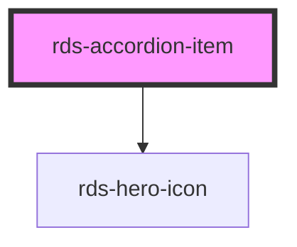

## rds-accordion-item Readme

<!-- Auto Generated Below -->

### Properties

| Property    | Attribute    | Description                                                                                                                                | Type      | Default     |
| ----------- | ------------ | ------------------------------------------------------------------------------------------------------------------------------------------ | --------- | ----------- |
| `active`    | `active`     |                                                                                                                                            | `boolean` | `false`     |
| `itemTitle` | `item-title` | The text displayed for the accordion item title. You may use this prop instead of the slot if you are only adding plain text as the title. | `string`  | `undefined` |

### Slots

| Slot           | Description                                                                                                                                       |
| -------------- | ------------------------------------------------------------------------------------------------------------------------------------------------- |
|                | Used for adding content to your accordion item.                                                                                                   |
| `"item-title"` | Use this slot to add a title contents to your accordion item. You may add RDS components, such as RdsHeroIcon, alongside plain text, for example. |

### Dependencies

#### Depends on

- [rds-hero-icon](../rds-hero-icon)

#### Graph

----------------------------------------------

_Built for Resilience Design System @ FM Global_
