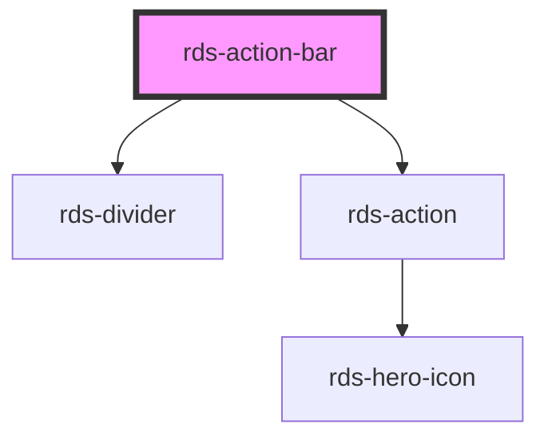

## rds-action-bar Readme

<rds-alert appearance="info" visible>
  
    React Integration Notes
  
  
    Component events can be used two ways:   
    Events will commonly be used as a React prop, in which case, they will be prefixed with 'on' and use camel case. Example: The React prop for the event `rdsOnChange` is `onRdsOnChange`.   
    Alternatively, you can attach an event listener to the component, in which case the event name remains the same.
  
</rds-alert>

<!-- Auto Generated Below -->

### Properties

| Property      | Attribute     | Description                                                        | Type      | Default |
| ------------- | ------------- | ------------------------------------------------------------------ | --------- | ------- |
| `collapsible` | `collapsible` | If `true`, action bar will stay in collapsed/non expandable state. | `boolean` | `true`  |

### Events

| Event                | Description                             | Type               |
| -------------------- | --------------------------------------- | ------------------ |
| `rdsActionBarToggle` | Emitted when expanded has been toggled. | `CustomEvent<any>` |

### Methods

#### `setFocus(focusId?: 'expand-toggle') => Promise<void>`

##### Returns

Type: `Promise<void>`

### Slots

| Slot              | Description                                                                                                                |
| ----------------- | -------------------------------------------------------------------------------------------------------------------------- |
|                   | Used for adding action items to your action bar.                                                                           |
| `"bottom-action"` | Use this slot to set an action on the collapsed action bar. This will be shown when the `collapsible` prop is set to true. |

### Dependencies

#### Depends on

- [rds-divider](../rds-divider)
- [rds-action](../rds-action)

#### Graph

----------------------------------------------

_Built for Resilience Design System @ FM Global_
