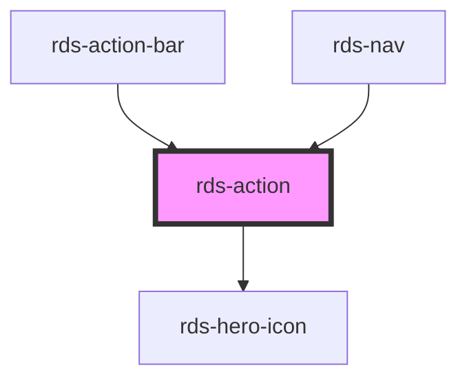

## rds-action Readme

<rds-alert appearance="info" visible>
  
    React Integration Notes
  
  
    Component events can be used two ways:   
    Events will commonly be used as a React prop, in which case, they will be prefixed with 'on' and use camel case. Example: The React prop for the event `rdsOnChange` is `onRdsOnChange`.   
    Alternatively, you can attach an event listener to the component, in which case the event name remains the same.
  
</rds-alert>

<!-- Auto Generated Below -->

### Properties

| Property            | Attribute      | Description                                                                                         | Type      | Default     |
| ------------------- | -------------- | --------------------------------------------------------------------------------------------------- | --------- | ----------- |
| `active`            | `active`       | Indicates whether the action is highlighted.                                                        | `boolean` | `false`     |
| `disabled`          | `disabled`     | When true, disabled prevents interaction. This state shows actions grayed out.                      | `boolean` | `false`     |
| `icon`              | `icon`         | The name of the icon to display. The value of this property must match the icon name from RDS Icons | `string`  | `undefined` |
| `label`             | `label`        | The label of the action.                                                                            | `string`  | `undefined` |
| `text` _(required)_ | `text`         | Text that accompanies the action icon.                                                              | `string`  | `undefined` |
| `textEnabled`       | `text-enabled` | Indicates whether the text is displayed.                                                            | `boolean` | `true`      |

### Events

| Event            | Description                               | Type               |
| ---------------- | ----------------------------------------- | ------------------ |
| `rdsActionClick` | Emitted when the action has been clicked. | `CustomEvent<any>` |

### Methods

#### `setFocus() => Promise<void>`

##### Returns

Type: `Promise<void>`

### Dependencies

#### Used by

 - [rds-action-bar](../rds-action-bar)
 - [rds-nav](../rds-nav)

#### Depends on

- [rds-hero-icon](../rds-hero-icon)

#### Graph

----------------------------------------------

 
