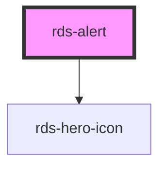

## rds-alert Readme

<rds-alert appearance="info" visible>
  
    React Integration Notes
  
  
    Component events can be used two ways:   
    Events will commonly be used as a React prop, in which case, they will be prefixed with 'on' and use camel case. Example: The React prop for the event `rdsOnChange` is `onRdsOnChange`.   
    Alternatively, you can attach an event listener to the component, in which case the event name remains the same.
  
</rds-alert>

<!-- Auto Generated Below -->

### Properties

| Property      | Attribute     | Description                                                                                  | Type                                          | Default                  |
| ------------- | ------------- | -------------------------------------------------------------------------------------------- | --------------------------------------------- | ------------------------ |
| `appearance`  | `appearance`  | The appearance of the Alert. Options are: `"info"`, `"error"`, `"warning"`, and `"success"`. | `"error" , "info" , "success" , "warning"` | `'info'`                 |
| `dismissible` | `dismissible` | If set to `true`, the alert has a dismiss button and is dismissible.                         | `boolean`                                     | `true`                   |
| `label`       | `label`       | This is for an accessible label on the primary action.                                       | `string`                                      | `'Alert primary action'` |
| `visible`     | `visible`     | If set to `false`, the alert will be hidden.                                                 | `boolean`                                     | `false`                  |

### Events

| Event             | Description                                | Type               |
| ----------------- | ------------------------------------------ | ------------------ |
| `rdsActionClick`  | Emitted when the action has been clicked.  | `CustomEvent<any>` |
| `rdsAlertDismiss` | Emitted when the alert has been dismissed. | `CustomEvent<any>` |

### Methods

#### `dismiss() => Promise<void>`

##### Returns

Type: `Promise<void>`

#### `setFocus() => Promise<void>`

##### Returns

Type: `Promise<void>`

### Slots

| Slot            | Description                                                                                                                  |
| --------------- | ---------------------------------------------------------------------------------------------------------------------------- |
| `"action-text"` | This is the text displayed as the primary action button in the alert. Place a span with slot="action-text" for best results. |
| `"message"`     | The message that is displayed below the title in alert. Place a span with slot="message" for best results.                   |
| `"title"`       | The title text of the alert. Place a span with slot="title" for best results.                                                |

### Dependencies

#### Depends on

- [rds-hero-icon](../rds-hero-icon)

#### Graph

----------------------------------------------

_Built for Resilience Design System @ FM Global_
