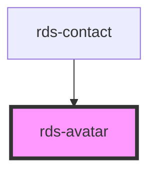

## rds-avatar Readme

<!-- Auto Generated Below -->

### Properties

| Property | Attribute | Description                                                                                                                    | Type      | Default     |
| -------- | --------- | ------------------------------------------------------------------------------------------------------------------------------ | --------- | ----------- |
| `shadow` | `shadow`  | **[DEPRECATED]** Set the drop shadow of the avatar for the deprecated phase 1 avatar.   | `boolean` | `false`     |
| `size`   | `size`    | Set the size of the avatar, default is lg. Options are: sm, md, lg and xl                                                      | `string`  | `'lg'`      |
| `src`    | `src`     | Set the image src for the image used as the avatar                                                                             | `string`  | `undefined` |
| `text`   | `text`    | Set the fallback initials when no image is present.                                                                            | `string`  | `undefined` |

### Slots

| Slot          | Description                               |
| ------------- | ----------------------------------------- |
| `"indicator"` | Used for adding indicator to your avatar. |

### Dependencies

#### Used by

 - [rds-contact](../rds-contact)

#### Graph

----------------------------------------------

_Built for Resilience Design System @ FM Global_
