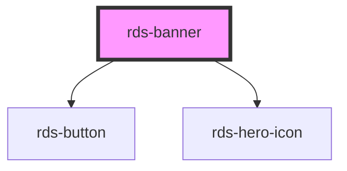

## rds-banner Readme

<!-- Auto Generated Below -->

### Properties

| Property      | Attribute     | Description                                       | Type                         | Default         |
| ------------- | ------------- | ------------------------------------------------- | ---------------------------- | --------------- |
| `appearance`  | `appearance`  | The appearance of the banner.                     | `"non-rounded" , "rounded"` | `'non-rounded'` |
| `dismissible` | `dismissible` | If set to `true`, the banner will be dismissable. | `boolean`                    | `true`          |

### Events

| Event                | Description                                 | Type               |
| -------------------- | ------------------------------------------- | ------------------ |
| `rdsBannerDismissed` | Emitted when the banner has been dismissed. | `CustomEvent<any>` |

### Methods

#### `dismiss() => Promise<void>`

##### Returns

Type: `Promise<void>`

### Slots

| Slot              | Description                                                                                   |
| ----------------- | --------------------------------------------------------------------------------------------- |
| `"content-left"`  | The left section for banner content. Place a div with slot="content-left" for best results.   |
| `"content-right"` | The right section for banner content. Place a div with slot="content-right" for best results. |

### Dependencies

#### Depends on

- [rds-button](../rds-button)
- [rds-hero-icon](../rds-hero-icon)

#### Graph

----------------------------------------------

_Built for Resilience Design System @ FM Global_
