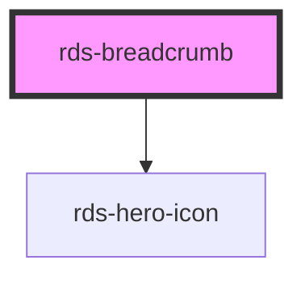

## rds-breadcrumb Readme

<!-- Auto Generated Below -->

### Properties

| Property    | Attribute   | Description                                                                | Type                   | Default     |
| ----------- | ----------- | -------------------------------------------------------------------------- | ---------------------- | ----------- |
| `separator` | `separator` | The separator of the Bread Crumbs. Options are: `"chevron"` and `"slash"`. | `"chevron" , "slash"` | `'chevron'` |

### Slots

| Slot | Description                                                                                                               |
| ---- | ------------------------------------------------------------------------------------------------------------------------- |
|      | A unnamed slot for adding the recommended `RdsLink` component, or another component of your choosing, to your breadcrumb. |

### Dependencies

#### Depends on

- [rds-hero-icon](../rds-hero-icon)

#### Graph

----------------------------------------------

_Built for Resilience Design System @ FM Global_
