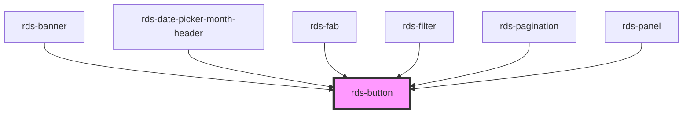

## rds-button Readme

<!-- Auto Generated Below -->

### Properties

| Property     | Attribute    | Description                                                                                                                                                                | Type                                                                                         | Default     |
| ------------ | ------------ | -------------------------------------------------------------------------------------------------------------------------------------------------------------------------- | -------------------------------------------------------------------------------------------- | ----------- |
| `active`     | `active`     | Active state for button. To be used within a button group or as part of a menu (secondary & tertiary appearances only). When true, button will appear active.              | `boolean`                                                                                    | `false`     |
| `appearance` | `appearance` | The appearance of the button. The options are different depending on the button `type`. _Note: Appearance types have been updated as part of the Phase 2 experience._      | `"danger" , "danger-lite" , "link" , "outline" , "primary" , "secondary" , "tertiary"` | `'primary'` |
| `disabled`   | `disabled`   | This property handles the disabled state of the button.                                                                                                                    | `boolean`                                                                                    | `false`     |
| `group`      | `group`      | Adds button group specific styles.                                                                                                                                         | `boolean`                                                                                    | `false`     |
| `href`       | `href`       | Contains a URL or a URL fragment that the hyperlink points to. If this property is set, an anchor tag will be rendered.                                                    | `string`                                                                                     | `undefined` |
| `iconOnly`   | `icononly`   | Adds extra padding on the button if an icon is the only contents.                                                                                                          | `boolean`                                                                                    | `false`     |
| `isFilter`   | `isfilter`   | **[DEPRECATED]** Custom attribute that can be used when `rds-filter` is needed. It applies a customEvent to trigger `rds-filter`.   | `boolean`                                                                                    | `false`     |
| `label`      | `label`      | Accessible label for button.                                                                                                                                               | `string`                                                                                     | `undefined` |
| `size`       | `size`       | The button size. _Note: The `"lg"` property is no longer full-width. See `"xl"` for full-width._                                                                           | `"lg" , "md" , "sm" , "xl"`                                                               | `undefined` |
| `target`     | `target`     | Specifies where to display the linked URL. Only applies when an `href` is provided.                                                                                        | `"_blank" , "_parent" , "_self" , "_top"`                                                 | `undefined` |
| `text`       | `text`       | **[DEPRECATED]** Old way of setting button text. You can now type within the button tags set the button text.                       | `string`                                                                                     | `undefined` |
| `type`       | `type`       | The type of the button.                                                                                                                                                    | `"button" , "reset" , "submit"`                                                            | `'button'`  |

### Events

| Event               | Description                                                | Type                  |
| ------------------- | ---------------------------------------------------------- | --------------------- |
| `filterToggleEvent` | **[DEPRECATED]**    | `CustomEvent<string>` |

### Methods

#### `isFormValid() => Promise<boolean>`

Checks a form's elements with constraint validations.
Button's `type` must equal 'submit' and must exist inside of a `<form>` container.

##### Returns

Type: `Promise<boolean>`

### Slots

| Slot      | Description                           |
| --------- | ------------------------------------- |
|           | Used to add text to your button.      |
| `"end"`   | Used to add trailing icon. (optional) |
| `"start"` | Used to add leading icon. (optional)  |

### Dependencies

#### Used by

 - [rds-banner](../rds-banner)
 - [rds-date-picker-month-header](../rds-form-elements/rds-date-picker-month-header)
 - [rds-fab](../rds-fab)
 - [rds-filter](../rds-filter)
 - [rds-pagination](../rds-pagination)
 - [rds-panel](../rds-panel)

#### Graph

----------------------------------------------

_Built for Resilience Design System @ FM Global_
