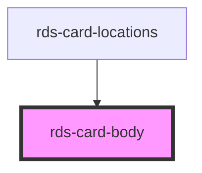

## rds-card-body Readme

<!-- Auto Generated Below -->

### Properties

| Property | Attribute | Description                                   | Type      | Default |
| -------- | --------- | --------------------------------------------- | --------- | ------- |
| `padded` | `padded`  | If `true`, a 1rem (16px) padding will appear. | `boolean` | `true`  |

### Slots

| Slot | Description                           |
| ---- | ------------------------------------- |
|      | Used to add content to the card body. |

### Dependencies

#### Used by

 - [rds-card-locations](../rds-card-locations)

#### Graph

----------------------------------------------

 
