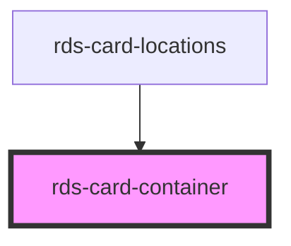

## rds-card-container Readme

<!-- Auto Generated Below -->

### Properties

| Property  | Attribute | Description                                                                                                        | Type      | Default |
| --------- | --------- | ------------------------------------------------------------------------------------------------------------------ | --------- | ------- |
| `rounded` | `rounded` | If `true`, round corners will be enabled for the card container.                                                   | `boolean` | `true`  |
| `shadow`  | `shadow`  | If `true`, a shadow will be visible around the card container.                                                     | `boolean` | `true`  |
| `simple`  | `simple`  | If `true`, the card container will inherit styles that allow it to stand on its own, without any other card parts. | `boolean` | `false` |

### Slots

| Slot | Description                                                          |
| ---- | -------------------------------------------------------------------- |
|      | Used to add content, or other card components to the card container. |

### Dependencies

#### Used by

 - [rds-card-locations](../rds-card-locations)

#### Graph

----------------------------------------------

 
