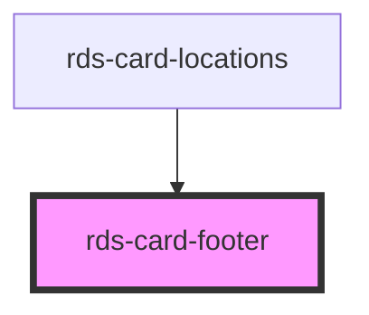

## rds-card-footer Readme

<!-- Auto Generated Below -->

### Properties

| Property | Attribute | Description                                                             | Type      | Default |
| -------- | --------- | ----------------------------------------------------------------------- | --------- | ------- |
| `padded` | `padded`  | If `true`, a 1rem (16px) padding will appear on left, right and bottom. | `boolean` | `true`  |
| `rule`   | `rule`    | If `true`, a top border will appear on the footer.                      | `boolean` | `false` |

### Slots

| Slot      | Description                                               |
| --------- | --------------------------------------------------------- |
|           | Used to add content to the entire card footer.            |
| `"end"`   | Used to add content to the right side of the card footer. |
| `"start"` | Used to add content to the left side of the card footer.  |

### Dependencies

#### Used by

 - [rds-card-locations](../rds-card-locations)

#### Graph

----------------------------------------------

 
