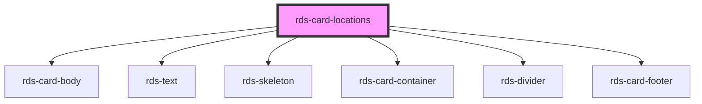

## rds-card-locations Readme

<!-- Auto Generated Below -->

### Properties

| Property        | Attribute        | Description                                                                                                                             | Type      | Default |
| --------------- | ---------------- | --------------------------------------------------------------------------------------------------------------------------------------- | --------- | ------- |
| `error`         | `error`          | **[DEPRECATED]** When error is true the card will display a message with a slot for action.      | `boolean` | `false` |
| `loading`       | `loading`        | **[DEPRECATED]** When error is true the card will display a message with a slot for action.      | `boolean` | `false` |
| `showLocations` | `show-locations` | **[DEPRECATED]** When enabled, this will show the first number box for showing Location Count.   | `boolean` | `false` |

### Slots

| Slot                                                                                            | Description                                                         |
| ----------------------------------------------------------------------------------------------- | ------------------------------------------------------------------- |
| `"description"`                                                                                 | Use this slot to add a description to the bottom of the card.       |
| `"location-info"`                                                                               | Use this slot to add a tooltip with locations info to the card.     |
| `"locations"`                                                                                   | Use this slot to add the number of locations to the card.           |
| `"locations-label"`                                                                             | Use this slot to add a label underneath the locations number.       |
| `"recommendations"`                                                                             | Use this slot to add the number of recommendations to the card.     |
| `"recommendations-info -Use this slot to add a tooltip with recommendations info to the card."` |                                                                     |
| `"recommendations-label"`                                                                       | Use this slot to add a label underneath the recommendations number. |
| `"title"`                                                                                       | Use this slot to add a title to the card.                           |

### Dependencies

#### Depends on

- [rds-card-body](../rds-card-body)
- [rds-text](../rds-text)
- [rds-skeleton](../rds-skeleton)
- [rds-card-container](../rds-card-container)
- [rds-divider](../rds-divider)
- [rds-card-footer](../rds-card-footer)

#### Graph

----------------------------------------------

_Built for Resilience Design System @ FM Global_
