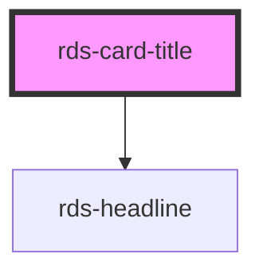

## rds-card-title Readme

<!-- Auto Generated Below -->

### Properties

| Property | Attribute | Description              | Type                         | Default |
| -------- | --------- | ------------------------ | ---------------------------- | ------- |
| `level`  | `level`   | Sets the headline level. | `1 , 2 , 3 , 4 , 5 , 6` | `4`     |

### Slots

| Slot | Description                                 |
| ---- | ------------------------------------------- |
|      | Use this slot to add title text/components. |

### Dependencies

#### Depends on

- [rds-headline](../rds-headline)

#### Graph

----------------------------------------------

 
