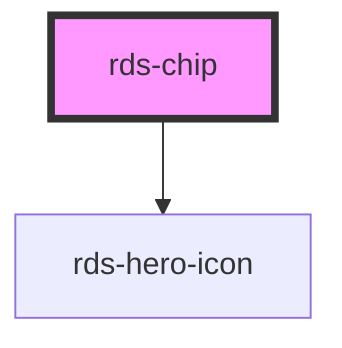

## rds-chip Readme

<rds-alert appearance="info" visible>
  
    React Integration Notes
  
  
    Component events can be used two ways:   
    Events will commonly be used as a React prop, in which case, they will be prefixed with 'on' and use camel case. Example: The React prop for the event `rdsOnChange` is `onRdsOnChange`.   
    Alternatively, you can attach an event listener to the component, in which case the event name remains the same.
  
</rds-alert>

<!-- Auto Generated Below -->

### Properties

| Property             | Attribute     | Description                                                                                                                                                                     | Type      | Default     |
| -------------------- | ------------- | ------------------------------------------------------------------------------------------------------------------------------------------------------------------------------- | --------- | ----------- |
| `active`             | `active`      | Optionally set active to display in active state                                                                                                                                | `boolean` | `undefined` |
| `clickable`          | `clickable`   | Optionally make the Chip clickable                                                                                                                                              | `boolean` | `false`     |
| `disabled`           | `disabled`    | If `true`, the user cannot interact with the chip.                                                                                                                              | `boolean` | `false`     |
| `dismissible`        | `dismissible` | Optionally show a button the user can click to dismiss the chip                                                                                                                 | `boolean` | `false`     |
| `icon`               | `icon`        | **[DEPRECATED]** - a dot is provided for active Chips. Icons are no longer accepted inside the Chip.  Optionally pass an icon to display | `string`  | `undefined` |
| `text`               | `text`        | Text displayed inside of the Chip                                                                                                                                               | `string`  | `undefined` |
| `value` _(required)_ | `value`       | Value to provide the Chip.                                                                                                                                                      | `any`     | `undefined` |

### Events

| Event            | Description                                | Type               |
| ---------------- | ------------------------------------------ | ------------------ |
| `rdsChipClick`   | Emitted when the dismiss button is clicked | `CustomEvent<any>` |
| `rdsChipDismiss` | Emitted when the dismiss button is clicked | `CustomEvent<any>` |

### Methods

#### `setFocus() => Promise<void>`

##### Returns

Type: `Promise<void>`

### Dependencies

#### Depends on

- [rds-hero-icon](../rds-hero-icon)

#### Graph

----------------------------------------------

_Built for Resilience Design System @ FM Global_
