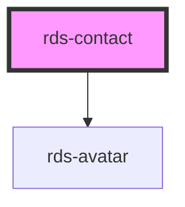

## rds-contact Readme

<!-- Auto Generated Below -->

### Properties

| Property     | Attribute     | Description                                                                 | Type     | Default     |
| ------------ | ------------- | --------------------------------------------------------------------------- | -------- | ----------- |
| `avatarText` | `avatar-text` | Initials shown when no image url provided.                                  | `string` | `undefined` |
| `avatarUrl`  | `avatar-url`  | This will set the url for the image in Avatar, if needed.                   | `string` | `undefined` |
| `detail`     | `detail`      | A third line of detail for additional information about the contact person. | `string` | `undefined` |
| `name`       | `name`        | Name to be displayed.                                                       | `string` | `undefined` |
| `role`       | `role`        | Role or other details to be shown below the name.                           | `string` | `undefined` |

### Slots

| Slot       | Description                                                            |
| ---------- | ---------------------------------------------------------------------- |
| `"action"` | This slot can be used to place one or more actions like a 'RdsButton'. |

### Dependencies

#### Depends on

- [rds-avatar](../rds-avatar)

#### Graph

----------------------------------------------

_Built for Resilience Design System @ FM Global_
