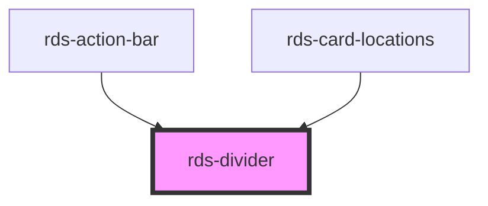

## rds-divider Readme

<!-- Auto Generated Below -->

### Properties

| Property     | Attribute    | Description                                                                                                                                                      | Type                             | Default        |
| ------------ | ------------ | ---------------------------------------------------------------------------------------------------------------------------------------------------------------- | -------------------------------- | -------------- |
| `appearance` | `appearance` | **[DEPRECATED]** Sets the appearance/color of the divider.                                                                | `"dark" , "light"`              | `'dark'`       |
| `spacing`    | `spacing`    | This determines the spacing around the divider. It will add margin to top/bottom for horizonal dividers. It will add margin to left/right for vertical dividers. | `"lg" , "md" , "none" , "sm"` | `'md'`         |
| `type`       | `type`       | Sets which direction the divider is oriented.                                                                                                                    | `"horizontal" , "vertical"`     | `'horizontal'` |

### Dependencies

#### Used by

 - [rds-action-bar](../rds-action-bar)
 - [rds-card-locations](../rds-card-locations)

#### Graph

----------------------------------------------

_Built for Resilience Design System @ FM Global_
