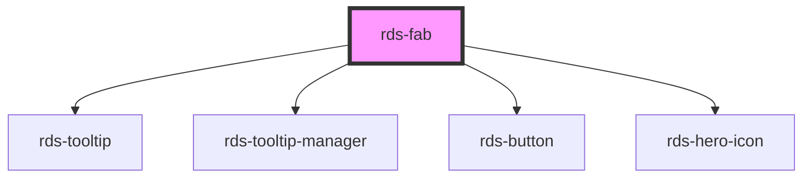

## rds-fab Readme

<rds-alert appearance="info" visible>
  
    React Integration Notes
  
  
    Component events can be used two ways:   
    Events will commonly be used as a React prop, in which case, they will be prefixed with 'on' and use camel case. Example: The React prop for the event `rdsOnChange` is `onRdsOnChange`.   
    Alternatively, you can attach an event listener to the component, in which case the event name remains the same.
  
</rds-alert>

<!-- Auto Generated Below -->

### Properties

| Property   | Attribute  | Description                                                                                                                     | Type                   | Default     |
| ---------- | ---------- | ------------------------------------------------------------------------------------------------------------------------------- | ---------------------- | ----------- |
| `disabled` | `disabled` | When true, disabled prevents interaction. This state will not emit the rdsFabClicked event when set to true.                    | `boolean`              | `false`     |
| `icon`     | `icon`     | What icon to be displayed. Icons can be found in our `RdsHeroIcon` component.                                                   | `string`               | `'plus'`    |
| `label`    | `label`    | Accessible label for button. If text is provided, text is used. Otherwise it will default to this label if text isn't provided. | `string`               | `undefined` |
| `size`     | `size`     | Sets the FAB button size.                                                                                                       | `"lg" , "md" , "sm"` | `'md'`      |
| `text`     | `text`     | Text that displays in the tooltip on FAB hover                                                                                  | `string`               | `undefined` |
| `tooltip`  | `tooltip`  | This property can be used to disable the tooltip on hover. Default shows tooltip with text or label.                            | `boolean`              | `true`      |

### Events

| Event           | Description                        | Type               |
| --------------- | ---------------------------------- | ------------------ |
| `rdsFabClicked` | Emitted when fab has been clicked. | `CustomEvent<any>` |

### Methods

#### `setFocus() => Promise<void>`

##### Returns

Type: `Promise<void>`

### Dependencies

#### Depends on

- [rds-tooltip](../rds-tooltip)
- [rds-tooltip-manager](../rds-tooltip-manager)
- [rds-button](../rds-button)
- [rds-hero-icon](../rds-hero-icon)

#### Graph

----------------------------------------------

_Built for Resilience Design System @ FM Global_
