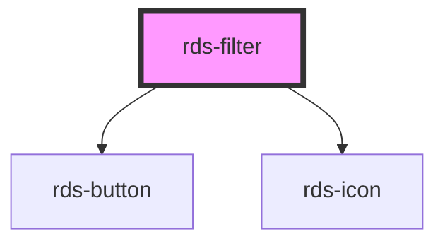

## rds-filter Readme

<!-- Auto Generated Below -->

### Properties

| Property        | Attribute       | Description                                                                                                          | Type      | Default    |
| --------------- | --------------- | -------------------------------------------------------------------------------------------------------------------- | --------- | ---------- |
| `filterResults` | `filterresults` | **[DEPRECATED]** Apply filter search results for mobile breakpoints           | `number`  | `0`        |
| `isToggled`     | `istoggled`     | **[DEPRECATED]** Sets the toggle property of the filter component container   | `boolean` | `false`    |
| `label`         | `label`         | **[DEPRECATED]** Accessible label for filter.                                 | `string`  | `'filter'` |

### Slots

| Slot               | Description                        |
| ------------------ | ---------------------------------- |
| `"clear-filter"`   | Used to add a clear button.        |
| `"filter-list"`    | Used to add a group of checkboxes. |
| `"filter-results"` | Used to add filter results.        |
| `"submit-filter"`  | Used to add a submit button.       |

### Dependencies

#### Depends on

- [rds-button](../rds-button)
- [rds-icon](../rds-icon)

#### Graph

----------------------------------------------

_Built for Resilience Design System @ FM Global_
