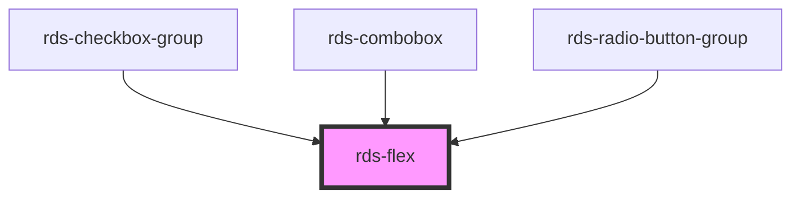

## rds-flex Readme

<!-- Auto Generated Below -->

### Properties

| Property         | Attribute         | Description                                                                                                                                                                                                                                                                 | Type                                                                                                                     | Default     |
| ---------------- | ----------------- | --------------------------------------------------------------------------------------------------------------------------------------------------------------------------------------------------------------------------------------------------------------------------- | ------------------------------------------------------------------------------------------------------------------------ | ----------- |
| `alignContent`   | `align-content`   | Space between and around flex items along the main-axis of the container, when the flex items span multiple lines. This only takes effect when `wrap` is set to true.                                                                                                       | `"center" , "flex-end" , "flex-start" , "space-around" , "space-between" , "space-evenly" , string[]`              | `undefined` |
| `alignItems`     | `align-items`     | Space between and around flex items along the cross-axis of the container.                                                                                                                                                                                                  | `"baseline" , "center" , "flex-end" , "flex-start" , "stretch" , string[]`                                          | `undefined` |
| `direction`      | `direction`       | The direction of the main axis.                                                                                                                                                                                                                                             | `"column" , "column-reverse" , "row" , "row-reverse" , string[]`                                                     | `undefined` |
| `gap`            | `gap`             | Explicitly controls the space between flex items. It applies that spacing only between items not on the outer edges. It can be one value for row & column gap, or two values to set row & column gaps differently. Accepts an RDS layout value or a valid CSS length value. | `string , string[]`                                                                                                     | `undefined` |
| `height`         | `height`          | Explicitly controls the height of the flex component. This can be pixel, em, rem, calc(), or % values.                                                                                                                                                                      | `string , string[]`                                                                                                     | `'auto'`    |
| `inline`         | `inline`          | If true, the flex container is displayed at inline level rather than block level.                                                                                                                                                                                           | `any`                                                                                                                    | `undefined` |
| `justifyContent` | `justify-content` | Space between and around flex items along the main axis of the container.                                                                                                                                                                                                   | `"center" , "flex-end" , "flex-start" , "space-around" , "space-between" , "space-evenly" , "stretch" , string[]` | `undefined` |
| `wrap`           | `wrap`            | Whether or not the flex items should wrap to a new line when necessary.                                                                                                                                                                                                     | `any`                                                                                                                    | `undefined` |

### Slots

| Slot | Description                                                               |
| ---- | ------------------------------------------------------------------------- |
|      | Used for adding flex items or other elements/components as flex children. |

### Dependencies

#### Used by

 - [rds-checkbox-group](../rds-form-elements/rds-checkbox-group)
 - [rds-combobox](../rds-form-elements/rds-combobox)
 - [rds-radio-button-group](../rds-form-elements/rds-radio-button-group)

#### Graph

----------------------------------------------

 
