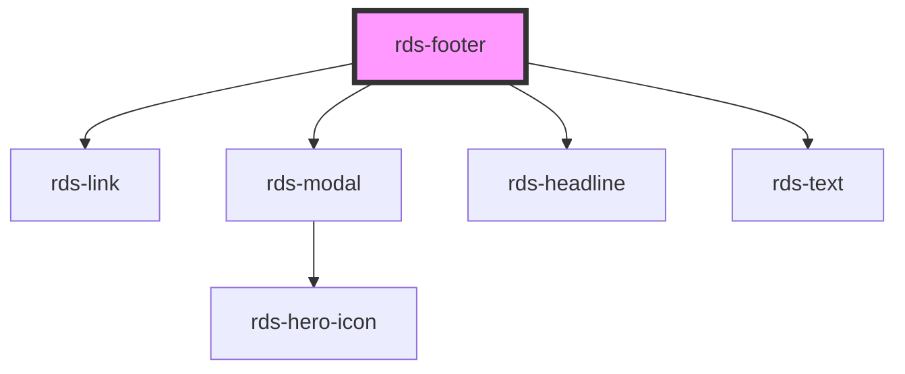

## rds-footer Readme

<!-- Auto Generated Below -->

### Properties

| Property          | Attribute         | Description                                                                                         | Type      | Default                                                            |
| ----------------- | ----------------- | --------------------------------------------------------------------------------------------------- | --------- | ------------------------------------------------------------------ |
| `confidentiality` | `confidentiality` | This determines display of the Confidentiality Notice                                               | `boolean` | `false`                                                            |
| `disclaimer`      | `disclaimer`      | **[DEPRECATED]** This determines display of the Disclaimer   | `boolean` | `false`                                                            |
| `help`            | `help`            | This determines display of the Help link                                                            | `boolean` | `true`                                                             |
| `helpHref`        | `help-href`       | This allows the help link to have a dynamic e-mail                                                  | `string`  | `'mailto:drrservicedesk@fmglobal.com'`                             |
| `positionFixed`   | `position-fixed`  | This determines to set the footer at the bottom of the page.                                        | `boolean` | `false`                                                            |
| `survey`          | `survey`          | This determines display of the Survey Link                                                          | `boolean` | `false`                                                            |
| `surveyUrl`       | `survey-url`      | This is the url for the survey ("Give Feedback") url.                                               | `string`  | `'https://fmglobal.az1.qualtrics.com/jfe/form/SV_bkCKj7GV5vzC2tE'` |

### Events

| Event              | Description                                                                                                                                                                                                                                           | Type               |
| ------------------ | ----------------------------------------------------------------------------------------------------------------------------------------------------------------------------------------------------------------------------------------------------- | ------------------ |
| `rdsFooterClicked` | Emitted when a footer link is clicked. Use the "onRdsFooterClicked" prop or listen for "rdsFooterClicked" event. This event will emit a string value depending on which link is clicked: "terms", "confidentiality", "privacy", "feedback" and "help" | `CustomEvent<any>` |

### Dependencies

#### Depends on

- [rds-link](../rds-link)
- [rds-modal](../rds-modal)
- [rds-headline](../rds-headline)
- [rds-text](../rds-text)

#### Graph

----------------------------------------------

_Built for Resilience Design System @ FM Global_
