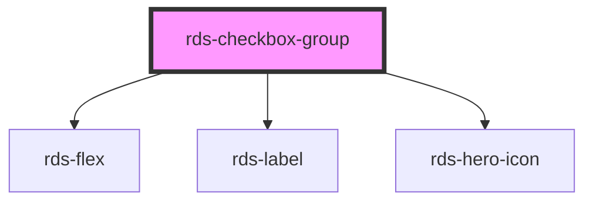

## rds-checkbox-group Readme

<!-- Auto Generated Below -->

### Properties

| Property    | Attribute   | Description                                                                                     | Type                                                        | Default              |
| ----------- | ----------- | ----------------------------------------------------------------------------------------------- | ----------------------------------------------------------- | -------------------- |
| `direction` | `direction` | Sets the direction of the individual checkboxes                                                 | `"horizontal" , "vertical"`                                | `'vertical'`         |
| `disabled`  | `disabled`  | Sets the disabled property of all slotted checkboxes.                                           | `boolean`                                                   | `false`              |
| `label`     | `label`     | Sets the label for the entire checkbox group                                                    | `string`                                                    | `undefined`          |
| `name`      | `name`      | Sets the name property of all slotted checkboxes.                                               | `string`                                                    | `undefined`          |
| `required`  | `required`  | Sets the required property of all slotted checkboxes                                            | `boolean`                                                   | `false`              |
| `type`      | `type`      | Sets the type property of all slotted checkboxes.                                               | `"card" , "default" , "description-list" , "small-card"` | `'description-list'` |
| `validate`  | `validate`  | If `true`, the checkbox group will be validated against the constraint validators that are set. | `boolean`                                                   | `false`              |

### Events

| Event              | Description                                                    | Type                                     |
| ------------------ | -------------------------------------------------------------- | ---------------------------------------- |
| `rdsGroupOnChange` | Emits when a checkbox within the group is selected/unselected. | `CustomEvent<CheckboxChangeEventDetail>` |

### Methods

#### `validateConstraint() => Promise<boolean>`

##### Returns

Type: `Promise<boolean>`

### Slots

| Slot                | Description                                                              |
| ------------------- | ------------------------------------------------------------------------ |
|                     | Used to add checkboxes into the checkbox group.                          |
| `"group-sub-label"` | Use this slot to add a group-sub-label component to your checkbox group. |

### Dependencies

#### Depends on

- [rds-flex](../../rds-flex)
- [rds-label](../rds-label)
- [rds-hero-icon](../../rds-hero-icon)

#### Graph

----------------------------------------------

_Built for Resilience Design System @ FM Global_
