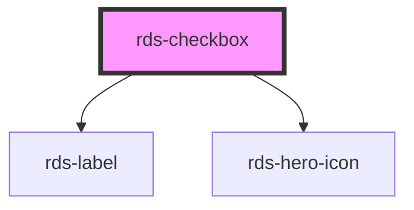

## rds-checkbox Readme

<rds-alert appearance="info" visible>
  
    React Integration Notes
  
  
    Component events can be used two ways:   
    Events will commonly be used as a React prop, in which case, they will be prefixed with 'on' and use camel case. Example: The React prop for the event `rdsOnChange` is `onRdsOnChange`.   
    Alternatively, you can attach an event listener to the component, in which case the event name remains the same.
  
</rds-alert>

<!-- Auto Generated Below -->

### Properties

| Property   | Attribute  | Description                                                                               | Type                                                        | Default        |
| ---------- | ---------- | ----------------------------------------------------------------------------------------- | ----------------------------------------------------------- | -------------- |
| `checked`  | `checked`  | Set the default checked value to false.                                                   | `boolean`                                                   | `false`        |
| `disabled` | `disabled` | Set the disabled state to false.                                                          | `boolean`                                                   | `false`        |
| `error`    | `error`    | If `true`, checkbox will be in error/invalid mode.                                        | `boolean`                                                   | `false`        |
| `label`    | `label`    | Set the label string value.                                                               | `string`                                                    | `undefined`    |
| `name`     | `name`     | The id of the element.                                                                    | `string`                                                    | `this.inputId` |
| `required` | `required` | Whether or not the checkbox is required.                                                  | `boolean`                                                   | `false`        |
| `type`     | `type`     | Set the appearance type of checkbox.                                                      | `"card" , "default" , "description-list" , "small-card"` | `'default'`    |
| `validate` | `validate` | If `true`, the checkbox will be validated against the constraint validators that are set. | `boolean`                                                   | `false`        |
| `value`    | `value`    | The value of the checkbox input.                                                          | `any`                                                       | `undefined`    |

### Events

| Event         | Description                                    | Type                                     |
| ------------- | ---------------------------------------------- | ---------------------------------------- |
| `rdsOnBlur`   | Emitted when the checkbox loses focus.         | `CustomEvent<void>`                      |
| `rdsOnChange` | Emitted when the checked property has changed. | `CustomEvent<CheckboxChangeEventDetail>` |
| `rdsOnFocus`  | Emitted when the checkbox has focus.           | `CustomEvent<void>`                      |

### Methods

#### `validateConstraint() => Promise<void>`

Validates the checkbox's `input` element.

##### Returns

Type: `Promise<void>`

### Slots

| Slot             | Description                                                                    |
| ---------------- | ------------------------------------------------------------------------------ |
| `"card-content"` | Use this slot to add additional content below the label of your card checkbox. |
| `"sub-label"`    | Use this slot to add a sub-label component to your checkbox.                   |

### Dependencies

#### Depends on

- [rds-label](../rds-label)
- [rds-hero-icon](../../rds-hero-icon)

#### Graph

----------------------------------------------

_Built for Resilience Design System @ FM Global_
