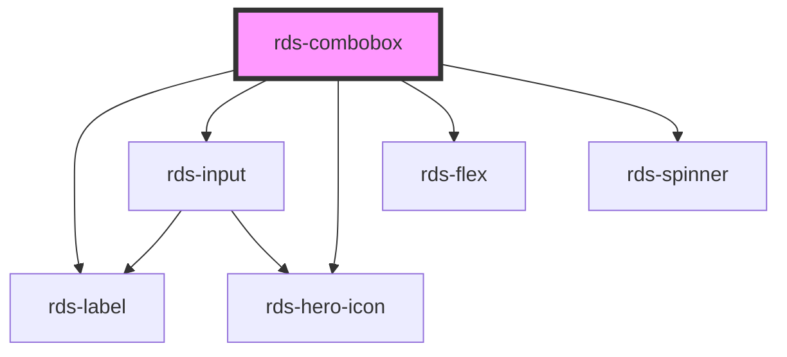

## rds-combobox Readme

<!-- Auto Generated Below -->

### Properties

| Property             | Attribute             | Description                                                                                                                        | Type                    | Default      |
| -------------------- | --------------------- | ---------------------------------------------------------------------------------------------------------------------------------- | ----------------------- | ------------ |
| `active`             | `active`              | Opens or closes the combobox                                                                                                       | `boolean`               | `false`      |
| `disabled`           | `disabled`            | Disable combobox input                                                                                                             | `boolean`               | `false`      |
| `error`              | `error`               | When true, there is an error in fetch.                                                                                             | `boolean`               | `false`      |
| `label` _(required)_ | `label`               | Aria label for combobox (required)                                                                                                 | `string`                | `undefined`  |
| `loading`            | `loading`             | When true, API is fetching data.                                                                                                   | `boolean`               | `false`      |
| `maxItems`           | `max-items`           | Specify the maximum number of combobox items (including nested children) to display before showing the scroller                    | `number`                | `0`          |
| `name`               | `name`                | The name of the switch input                                                                                                       | `string`                | `undefined`  |
| `noResult`           | `no-result`           | When true, API is not returning the data.                                                                                          | `boolean`               | `false`      |
| `overlayPositioning` | `overlay-positioning` | Describes the type of positioning to use for the overlaid content. If your element is in a fixed container, use the 'fixed' value. | `"absolute" , "fixed"` | `'absolute'` |
| `placeholder`        | `placeholder`         | Placeholder text for input                                                                                                         | `string`                | `undefined`  |
| `required`           | `required`            | When true, the combobox is required.                                                                                               | `boolean`               | `false`      |
| `validate`           | `validate`            | If `true`, the combobox will be validated against the constraint validators that are set.                                          | `boolean`               | `false`      |
| `value`              | `value`               | The value(s) of the selectedItem(s)                                                                                                | `string`                | `null`       |

### Events

| Event                     | Description                                                      | Type                                                                         |
| ------------------------- | ---------------------------------------------------------------- | ---------------------------------------------------------------------------- |
| `rdsComboboxChange`       | Called when the selected item(s) changes.                        | `CustomEvent<{ selectedItem: HTMLRdsComboboxItemElement; }>`                 |
| `rdsComboboxFilterChange` | Called when the user has entered text to filter the options list | `CustomEvent<{ visibleItems: HTMLRdsComboboxItemElement[]; text: string; }>` |
| `rdsOnInput`              | Emitted when a keyboard input occurred.                          | `CustomEvent<any>`                                                           |

### Methods

#### `reposition() => Promise<void>`

Updates the position of the component.

##### Returns

Type: `Promise<void>`

#### `setFocus() => Promise<void>`

Sets focus on the component.

##### Returns

Type: `Promise<void>`

### Slots

| Slot           | Description                                                                                    |
| -------------- | ---------------------------------------------------------------------------------------------- |
|                | A slot for adding `combobox-item`s.                                                            |
| `"error-text"` | Use this slot to set custom error text for your combobox's input.                              |
| `"help-text"`  | Sets and adds optional helper text to your combobox's input. Use plain text only to this slot. |

### Dependencies

#### Depends on

- [rds-label](../rds-label)
- [rds-input](../rds-input)
- [rds-hero-icon](../../rds-hero-icon)
- [rds-flex](../../rds-flex)
- [rds-spinner](../../rds-spinner)

#### Graph

----------------------------------------------

 
