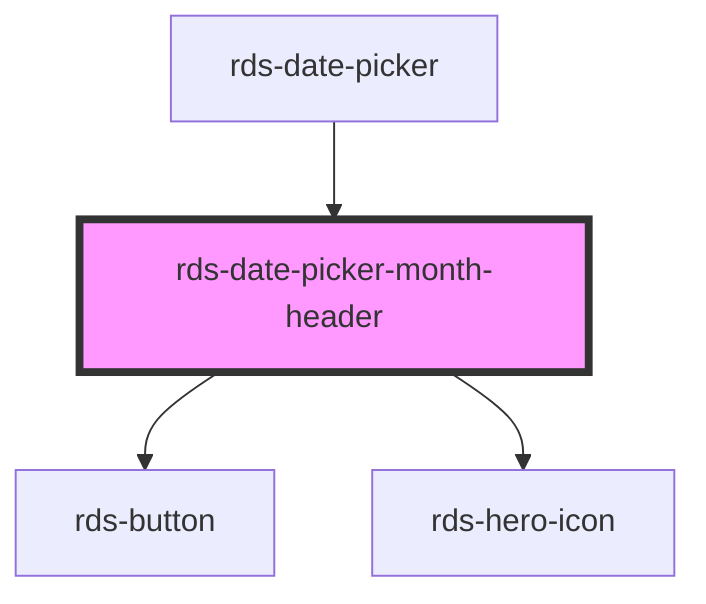

# calcite-date-month-header

<!-- Auto Generated Below -->

### Properties

| Property        | Attribute         | Description                                                              | Type                         | Default     |
| --------------- | ----------------- | ------------------------------------------------------------------------ | ---------------------------- | ----------- |
| `activeDate`    | --                | Focused date with indicator (will become selected date if user proceeds) | `Date`                       | `undefined` |
| `headingLevel`  | `heading-level`   | Number at which section headings should start for this component.        | `1 , 2 , 3 , 4 , 5 , 6` | `2`         |
| `intlNextMonth` | `intl-next-month` | Localized string for next month.                                         | `string`                     | `undefined` |
| `intlPrevMonth` | `intl-prev-month` | Localized string for previous month.                                     | `string`                     | `undefined` |
| `intlYear`      | `intl-year`       | Localized string for year.                                               | `string`                     | `undefined` |
| `locale`        | `locale`          | User's language and region as BCP 47 formatted string.                   | `string`                     | `undefined` |
| `localeData`    | --                | CLDR locale data for translated calendar info                            | `DateLocaleData`             | `undefined` |
| `max`           | --                | Maximum date of the calendar above which is disabled.                    | `Date`                       | `undefined` |
| `min`           | --                | Minimum date of the calendar below which is disabled.                    | `Date`                       | `undefined` |
| `selectedDate`  | --                | Already selected date.                                                   | `Date`                       | `undefined` |

### Events

| Event                 | Description            | Type                |
| --------------------- | ---------------------- | ------------------- |
| `rdsDatePickerSelect` | Changes to active date | `CustomEvent<Date>` |

### Dependencies

#### Used by

 - [rds-date-picker](../rds-date-picker)

#### Depends on

- [rds-button](../../rds-button)
- [rds-hero-icon](../../rds-hero-icon)

#### Graph

----------------------------------------------

_Built for Resilience Design System @ FM Global_
