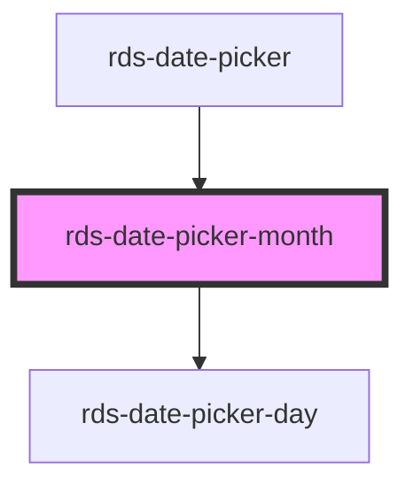

# calcite-date-month

<!-- Auto Generated Below -->

### Properties

| Property       | Attribute | Description                                           | Type         | Default      |
| -------------- | --------- | ----------------------------------------------------- | ------------ | ------------ |
| `activeDate`   | --        | Date currently active.                                | `Date`       | `new Date()` |
| `endDate`      | --        | End date currently active                             | `Date`       | `undefined`  |
| `hoverRange`   | --        | The range of dates currently being hovered            | `HoverRange` | `undefined`  |
| `max`          | --        | Maximum date of the calendar above which is disabled. | `Date`       | `undefined`  |
| `min`          | --        | Minimum date of the calendar below which is disabled. | `Date`       | `undefined`  |
| `selectedDate` | --        | Already selected date.                                | `Date`       | `undefined`  |
| `startDate`    | --        | Start date currently active.                          | `Date`       | `undefined`  |

### Events

| Event                           | Description                               | Type               |
| ------------------------------- | ----------------------------------------- | ------------------ |
| `rdsDatePickerActiveDateChange` | Active date for the user keyboard access. | `CustomEvent<any>` |
| `rdsDatePickerSelect`           | Event emitted when user selects the date. | `CustomEvent<any>` |

### Dependencies

#### Used by

 - [rds-date-picker](../rds-date-picker)

#### Depends on

- [rds-date-picker-day](../rds-date-picker-day)

#### Graph

----------------------------------------------

_Built for Resilience Design System @ FM Global_
