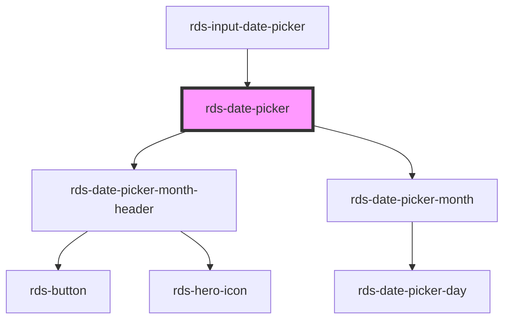

## rds-date-picker Readme

The `rds-date-picker` component allows for selecting a date via a calendar or text input. It supports multiple locales, languages, right to left, and is fully keyboard accessible.

<!-- Auto Generated Below -->

### Properties

| Property                     | Attribute                      | Description                                                                                                              | Type                         | Default                                   |
| ---------------------------- | ------------------------------ | ------------------------------------------------------------------------------------------------------------------------ | ---------------------------- | ----------------------------------------- |
| `activeRange`                | `active-range`                 | Active range                                                                                                             | `"end" , "start"`           | `undefined`                               |
| `end`                        | `end`                          | **[DEPRECATED]** use value instead  Selected end date                             | `string`                     | `undefined`                               |
| `endAsDate`                  | --                             | **[DEPRECATED]** use valueAsDate instead  Selected end date as full date object   | `Date`                       | `undefined`                               |
| `headingLevel`               | `heading-level`                | Number at which section headings should start for this component.                                                        | `1 , 2 , 3 , 4 , 5 , 6` | `undefined`                               |
| `intlNextMonth`              | `intl-next-month`              | Localized string for "next month" (used for aria label)                                                                  | `string`                     | `TEXT.nextMonth`                          |
| `intlPrevMonth`              | `intl-prev-month`              | Localized string for "previous month" (used for aria label)                                                              | `string`                     | `TEXT.prevMonth`                          |
| `intlYear`                   | `intl-year`                    | Localized string for "year" (used for aria label)                                                                        | `string`                     | `TEXT.year`                               |
| `locale`                     | `locale`                       | BCP 47 language tag for desired language and country format                                                              | `string`                     | `document.documentElement.lang ,, 'en'` |
| `max`                        | `max`                          | Latest allowed date ("yyyy-mm-dd")                                                                                       | `string`                     | `undefined`                               |
| `maxAsDate`                  | --                             | Latest allowed date as full date object                                                                                  | `Date`                       | `undefined`                               |
| `min`                        | `min`                          | Earliest allowed date ("yyyy-mm-dd")                                                                                     | `string`                     | `undefined`                               |
| `minAsDate`                  | --                             | Earliest allowed date as full date object                                                                                | `Date`                       | `undefined`                               |
| `proximitySelectionDisabled` | `proximity-selection-disabled` | Disables the default behaviour on the third click of narrowing or extending the range and instead starts a new range.    | `boolean`                    | `false`                                   |
| `range`                      | `range`                        | Range mode activation                                                                                                    | `boolean`                    | `false`                                   |
| `start`                      | `start`                        | **[DEPRECATED]** use value instead  Selected start date                           | `string`                     | `undefined`                               |
| `startAsDate`                | --                             | **[DEPRECATED]** use valueAsDate instead  Selected start date as full date object | `Date`                       | `undefined`                               |
| `value`                      | `value`                        | Selected date                                                                                                            | `string , string[]`         | `undefined`                               |
| `valueAsDate`                | --                             | Selected date as full date object                                                                                        | `Date , Date[]`             | `undefined`                               |

### Events

| Event                      | Description                                             | Type                           |
| -------------------------- | ------------------------------------------------------- | ------------------------------ |
| `rdsDatePickerChange`      | Trigger date change when a user changes the date.       | `CustomEvent<Date>`            |
| `rdsDatePickerRangeChange` | Trigger date change when a user changes the date range. | `CustomEvent<DateRangeChange>` |

### Dependencies

#### Used by

 - [rds-input-date-picker](../rds-input-date-picker)

#### Depends on

- [rds-date-picker-month-header](../rds-date-picker-month-header)
- [rds-date-picker-month](../rds-date-picker-month)

#### Graph

----------------------------------------------

_Built for Resilience Design System @ FM Global_
