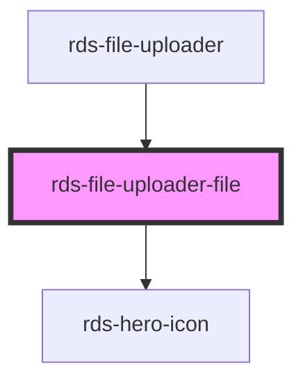

## rds-file-uploader-file Readme

<!-- Auto Generated Below -->

### Properties

| Property | Attribute | Description        | Type     | Default |
| -------- | --------- | ------------------ | -------- | ------- |
| `fileId` | `file-id` | Sets the file id   | `number` | `null`  |
| `name`   | `name`    | Sets the file name | `string` | `''`    |

### Events

| Event            | Description                               | Type               |
| ---------------- | ----------------------------------------- | ------------------ |
| `rdsRemovedFile` | Event that gets triggered on file removal | `CustomEvent<any>` |

### Dependencies

#### Used by

 - [rds-file-uploader](..)

#### Depends on

- [rds-hero-icon](../../../rds-hero-icon)

#### Graph

----------------------------------------------

_Built for Resilience Design System @ FM Global_
