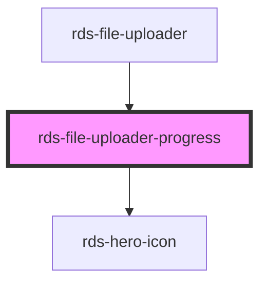

## rds-file-uploader-progress Readme

<!-- Auto Generated Below -->

### Properties

| Property              | Attribute   | Description                    | Type     | Default     |
| --------------------- | ----------- | ------------------------------ | -------- | ----------- |
| `error`               | `error`     | Error text for the file upload | `string` | `''`        |
| `fileId` _(required)_ | `file-id`   | Sets the file id               | `number` | `undefined` |
| `fileName`            | `file-name` | Sets the file name             | `string` | `''`        |
| `progress`            | `progress`  | File upload progress           | `number` | `0`         |

### Events

| Event              | Description                      | Type               |
| ------------------ | -------------------------------- | ------------------ |
| `rdsRetriedUpload` | Event to emit in case of a retry | `CustomEvent<any>` |

### Dependencies

#### Used by

 - [rds-file-uploader](..)

#### Depends on

- [rds-hero-icon](../../../rds-hero-icon)

#### Graph

----------------------------------------------

 
