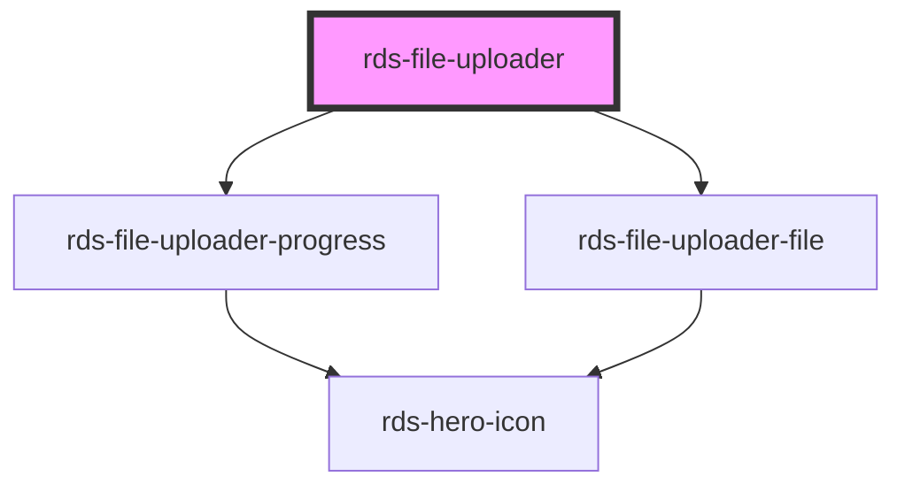

## rds-file-uploader Readme

<!-- Auto Generated Below -->

### Properties

| Property             | Attribute               | Description                                                                     | Type                | Default                           |
| -------------------- | ----------------------- | ------------------------------------------------------------------------------- | ------------------- | --------------------------------- |
| `accept`             | `accept`                | Comma separated string; tells us what file formats file uploader should accept. | `string`            | `''`                              |
| `acceptError`        | `accept-error`          | Error message to display when format is invalid.                                | `string`            | `'File format not accepted'`      |
| `actionParams`       | `action-params`         | Additional information to send to server other than the file.                   | `any`               | `{}`                              |
| `actionURL`          | `action-u-r-l`          | URL to make server call.                                                        | `string`            | `''`                              |
| `description`        | `description`           | File uploader description.                                                      | `string`            | `'or drag and drop'`              |
| `fileUploadError`    | `file-upload-error`     | Error message when a file upload fails.                                         | `string`            | `'File upload failed'`            |
| `filesLimit`         | `files-limit`           | Max files allowed to upload.                                                    | `number`            | `10`                              |
| `maxFileSize`        | `max-file-size`         | Maximum file size the file uploader must accept.                                | `number`            | `0`                               |
| `maxFileSizeError`   | `max-file-size-error`   | Error message to display when file size exceeds limit.                          | `string`            | `'Exceeding maximum file size'`   |
| `maxFilesLimitError` | `max-files-limit-error` | Error message when going beyond files limit.                                    | `string`            | `'Exceeding maximum files limit'` |
| `modifyRequest`      | --                      | Passes modifications to the xhr request.                                        | `(xhr: any) => any` | `xhr => xhr`                      |
| `multiple`           | `multiple`              | If multiple files are allowed.                                                  | `boolean`           | `false`                           |
| `text`               | `text`                  | File uploader text.                                                             | `string`            | `'Upload a file'`                 |

### Events

| Event               | Description                                          | Type               |
| ------------------- | ---------------------------------------------------- | ------------------ |
| `rdsFileReuploaded` | Event that gets emitted when file is reuploaded      | `CustomEvent<any>` |
| `rdsFilesUploaded`  | Event that gets emitted when files get uploaded      | `CustomEvent<any>` |
| `rdsStageChanged`   | Event that gets emitted when component stage changes | `CustomEvent<any>` |

### Methods

#### `uploadFiles() => Promise<void>`

Uploads the files to the server; emits an after file is uploaded

##### Returns

Type: `Promise<void>`

### Slots

| Slot     | Description                           |
| -------- | ------------------------------------- |
| `"hint"` | File uploader hint text / components. |

### Dependencies

#### Depends on

- [rds-file-uploader-progress](progress)
- [rds-file-uploader-file](file)

#### Graph

----------------------------------------------

 
