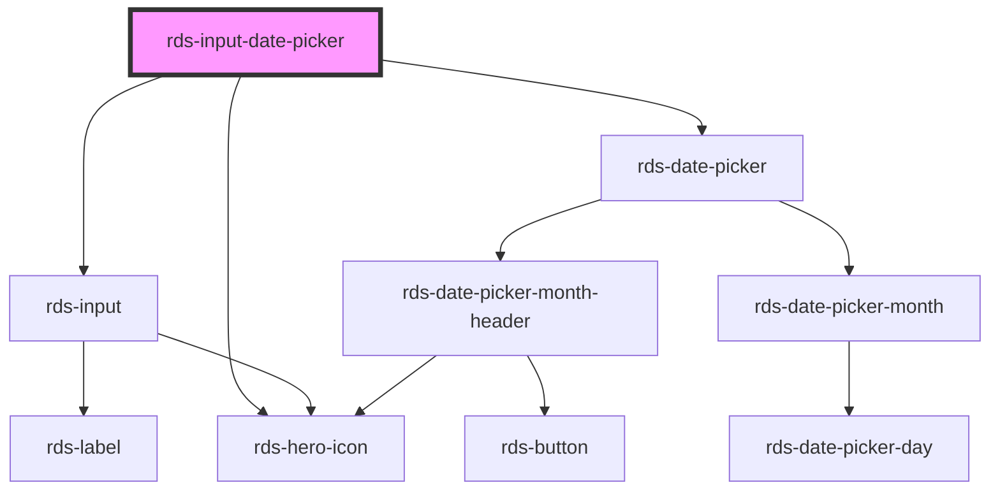

# calcite-input-date-picker

<!-- Auto Generated Below -->

### Properties

| Property                     | Attribute                      | Description                                                                                                                            | Type                    | Default          |
| ---------------------------- | ------------------------------ | -------------------------------------------------------------------------------------------------------------------------------------- | ----------------------- | ---------------- |
| `active`                     | `active`                       | Expand or collapse when calendar does not have input                                                                                   | `boolean`               | `false`          |
| `end`                        | `end`                          | Selected end date                                                                                                                      | `string`                | `undefined`      |
| `endAsDate`                  | --                             | **[DEPRECATED]** - Use valueByDate instead Selected end date as full date object                | `Date`                  | `undefined`      |
| `headingLevel`               | `heading-level`                | Number at which section headings should start for this component.                                                                      | `number`                | `2`              |
| `iconStart`                  | `icon-start`                   | Place the calendar icon in either leading or trailing position by setting the values as true/false respectively. Default value is true | `boolean`               | `true`           |
| `intlNextMonth`              | `intl-next-month`              | Localized string for "next month" (used for aria label)                                                                                | `string`                | `TEXT.nextMonth` |
| `intlPrevMonth`              | `intl-prev-month`              | Localized string for "previous month" (used for aria label)                                                                            | `string`                | `TEXT.prevMonth` |
| `locale`                     | `locale`                       | BCP 47 language tag for desired language and country format                                                                            | `string`                | `'en-GB'`        |
| `max`                        | `max`                          | Latest allowed date ("yyyy-mm-dd")                                                                                                     | `string`                | `undefined`      |
| `maxAsDate`                  | --                             | Latest allowed date as full date object                                                                                                | `Date`                  | `undefined`      |
| `min`                        | `min`                          | Earliest allowed date ("yyyy-mm-dd")                                                                                                   | `string`                | `undefined`      |
| `minAsDate`                  | --                             | Earliest allowed date as full date object                                                                                              | `Date`                  | `undefined`      |
| `overlayPositioning`         | `overlay-positioning`          | Describes the type of positioning to use for the overlaid content. If your element is in a fixed container, use the 'fixed' value.     | `"absolute" , "fixed"` | `'absolute'`     |
| `proximitySelectionDisabled` | `proximity-selection-disabled` | Disables the default behaviour on the third click of narrowing or extending the range and instead starts a new range.                  | `boolean`               | `false`          |
| `range`                      | `range`                        | Range mode activation                                                                                                                  | `boolean`               | `false`          |
| `required`                   | `required`                     | Whether or not the date picker is required.                                                                                            | `boolean`               | `false`          |
| `start`                      | `start`                        | Selected start date                                                                                                                    | `string`                | `undefined`      |
| `startAsDate`                | --                             | **[DEPRECATED]** - Use valueByDate instead Selected start date as full date object              | `Date`                  | `undefined`      |
| `validate`                   | `validate`                     | If `true`, the date picker will be validated against the constraint validators that are set.                                           | `boolean`               | `false`          |
| `value`                      | `value`                        | Selected date                                                                                                                          | `string , string[]`    | `undefined`      |
| `valueAsDate`                | --                             | Selected date as full date object                                                                                                      | `Date , Date[]`        | `undefined`      |

### Events

| Event                      | Description                                                 | Type                           |
| -------------------------- | ----------------------------------------------------------- | ------------------------------ |
| `rdsDatePickerChange`      | Trigger rds date change when a user changes the date.       | `CustomEvent<Date>`            |
| `rdsDatePickerRangeChange` | Trigger rds date change when a user changes the date range. | `CustomEvent<DateRangeChange>` |

### Methods

#### `reposition() => Promise<void>`

##### Returns

Type: `Promise<void>`

### Dependencies

#### Depends on

- [rds-input](../rds-input)
- [rds-hero-icon](../../rds-hero-icon)
- [rds-date-picker](../rds-date-picker)

#### Graph

----------------------------------------------

_Built for Resilience Design System @ FM Global_
