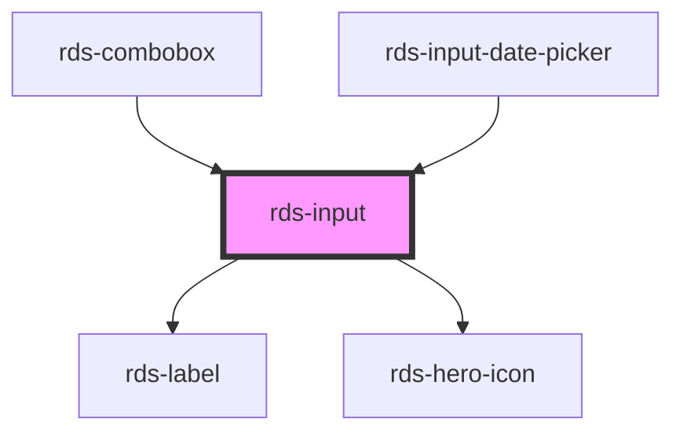

## rds-input Readme

<rds-alert appearance="info" visible>
  
    React Integration Notes
  
  
    Component events can be used two ways:   
    Events will commonly be used as a React prop, in which case, they will be prefixed with 'on' and use camel case. Example: The React prop for the event `rdsOnChange` is `onRdsOnChange`.   
    Alternatively, you can attach an event listener to the component, in which case the event name remains the same.
  
</rds-alert>

<!-- Auto Generated Below -->

### Properties

| Property         | Attribute         | Description                                                                                                                                                                                                                                      | Type                                                                                                                                                                                                                                                                                                                                                                                                                                                                                                                                                                                                                                                                                                                                                                                                                                                                                                                        | Default        |
| ---------------- | ----------------- | ------------------------------------------------------------------------------------------------------------------------------------------------------------------------------------------------------------------------------------------------ | --------------------------------------------------------------------------------------------------------------------------------------------------------------------------------------------------------------------------------------------------------------------------------------------------------------------------------------------------------------------------------------------------------------------------------------------------------------------------------------------------------------------------------------------------------------------------------------------------------------------------------------------------------------------------------------------------------------------------------------------------------------------------------------------------------------------------------------------------------------------------------------------------------------------------- | -------------- |
| `autocomplete`   | `autocomplete`    | Indicates whether the value of the control can be automatically completed by the browser.                                                                                                                                                        | `"on" , "off" , "name" , "honorific-prefix" , "given-name" , "additional-name" , "family-name" , "honorific-suffix" , "nickname" , "email" , "username" , "new-password" , "current-password" , "one-time-code" , "organization-title" , "organization" , "street-address" , "address-line1" , "address-line2" , "address-line3" , "address-level4" , "address-level3" , "address-level2" , "address-level1" , "country" , "country-name" , "postal-code" , "cc-name" , "cc-given-name" , "cc-additional-name" , "cc-family-name" , "cc-number" , "cc-exp" , "cc-exp-month" , "cc-exp-year" , "cc-csc" , "cc-type" , "transaction-currency" , "transaction-amount" , "language" , "bday" , "bday-day" , "bday-month" , "bday-year" , "sex" , "tel" , "tel-country-code" , "tel-national" , "tel-area-code" , "tel-local" , "tel-extension" , "impp" , "url" , "photo"` | `'off'`        |
| `disabled`       | `disabled`        | If `true`, input is set to disabled mode.                                                                                                                                                                                                        | `boolean`                                                                                                                                                                                                                                                                                                                                                                                                                                                                                                                                                                                                                                                                                                                                                                                                                                                                                                                   | `false`        |
| `error`          | `error`           | If `true`, input will be in error/invalid mode.                                                                                                                                                                                                  | `boolean`                                                                                                                                                                                                                                                                                                                                                                                                                                                                                                                                                                                                                                                                                                                                                                                                                                                                                                                   | `false`        |
| `helptext`       | `helptext`        | **[DEPRECATED]** If `true`, and slot contents are fulfilled, help text will appear below input component                                                                                                  | `boolean`                                                                                                                                                                                                                                                                                                                                                                                                                                                                                                                                                                                                                                                                                                                                                                                                                                                                                                                   | `false`        |
| `iconend`        | `iconend`         | **[DEPRECATED]** If `true`, icon will be displayed at the end of input component that will be on the right side                                                                                           | `boolean`                                                                                                                                                                                                                                                                                                                                                                                                                                                                                                                                                                                                                                                                                                                                                                                                                                                                                                                   | `false`        |
| `iconstart`      | `iconstart`       | **[DEPRECATED]** If `true`, icon will be displayed on start of input component that will be on left side                                                                                                  | `boolean`                                                                                                                                                                                                                                                                                                                                                                                                                                                                                                                                                                                                                                                                                                                                                                                                                                                                                                                   | `false`        |
| `inlineLeading`  | `inline-leading`  | Whether or not the leading addon to your input is inline.                                                                                                                                                                                        | `boolean`                                                                                                                                                                                                                                                                                                                                                                                                                                                                                                                                                                                                                                                                                                                                                                                                                                                                                                                   | `true`         |
| `inlineTrailing` | `inline-trailing` | Whether or not the leading addon to your input is inline.                                                                                                                                                                                        | `boolean`                                                                                                                                                                                                                                                                                                                                                                                                                                                                                                                                                                                                                                                                                                                                                                                                                                                                                                                   | `true`         |
| `label`          | `label`           | Label to be displayed in relation to its `RdsInput` component                                                                                                                                                                                    | `string`                                                                                                                                                                                                                                                                                                                                                                                                                                                                                                                                                                                                                                                                                                                                                                                                                                                                                                                    | `''`           |
| `max`            | `max`             | Defines maximum value allowed in number input and text input for min/max date..                                                                                                                                                                  | `string`                                                                                                                                                                                                                                                                                                                                                                                                                                                                                                                                                                                                                                                                                                                                                                                                                                                                                                                    | `undefined`    |
| `maxlength`      | `maxlength`       | Defines maximum number of character allowed.                                                                                                                                                                                                     | `number`                                                                                                                                                                                                                                                                                                                                                                                                                                                                                                                                                                                                                                                                                                                                                                                                                                                                                                                    | `undefined`    |
| `min`            | `min`             | Defines minimum value allowed in number input and text input for min/max date.                                                                                                                                                                   | `string`                                                                                                                                                                                                                                                                                                                                                                                                                                                                                                                                                                                                                                                                                                                                                                                                                                                                                                                    | `undefined`    |
| `minlength`      | `minlength`       | Defines minimum number of character allowed.                                                                                                                                                                                                     | `number`                                                                                                                                                                                                                                                                                                                                                                                                                                                                                                                                                                                                                                                                                                                                                                                                                                                                                                                    | `undefined`    |
| `name`           | `name`            | The name attribute of the input element.                                                                                                                                                                                                         | `string`                                                                                                                                                                                                                                                                                                                                                                                                                                                                                                                                                                                                                                                                                                                                                                                                                                                                                                                    | `this.inputId` |
| `pattern`        | `pattern`         | Defines regex pattern that input's value must match.                                                                                                                                                                                             | `string`                                                                                                                                                                                                                                                                                                                                                                                                                                                                                                                                                                                                                                                                                                                                                                                                                                                                                                                    | `undefined`    |
| `placeholder`    | `placeholder`     | Placeholder text to be displayed inside the `<input>` component                                                                                                                                                                                  | `string`                                                                                                                                                                                                                                                                                                                                                                                                                                                                                                                                                                                                                                                                                                                                                                                                                                                                                                                    | `undefined`    |
| `readonly`       | `readonly`        | If `true`, input is set to readonly mode.                                                                                                                                                                                                        | `boolean`                                                                                                                                                                                                                                                                                                                                                                                                                                                                                                                                                                                                                                                                                                                                                                                                                                                                                                                   | `undefined`    |
| `required`       | `required`        | Whether or not the input component is required.                                                                                                                                                                                                  | `boolean`                                                                                                                                                                                                                                                                                                                                                                                                                                                                                                                                                                                                                                                                                                                                                                                                                                                                                                                   | `false`        |
| `step`           | `step`            | Specifies the interval between legal numbers in number input and text input for min/max date.                                                                                                                                                    | `string`                                                                                                                                                                                                                                                                                                                                                                                                                                                                                                                                                                                                                                                                                                                                                                                                                                                                                                                    | `undefined`    |
| `type`           | `type`            | The type attribute of the input element.                                                                                                                                                                                                         | `"date" , "email" , "number" , "password" , "tel" , "text" , "url"`                                                                                                                                                                                                                                                                                                                                                                                                                                                                                                                                                                                                                                                                                                                                                                                                                                                   | `'text'`       |
| `validate`       | `validate`        | If `true`, the input will be validated against the constraint validators that are set.                                                                                                                                                           | `boolean`                                                                                                                                                                                                                                                                                                                                                                                                                                                                                                                                                                                                                                                                                                                                                                                                                                                                                                                   | `false`        |
| `validator`      | `validator`       | Defines the custom validation of the input. You must pass the array and object(s) as defined in the custom validation docs as a string so it can be parsed properly in all instances. Ex: '[{"name":"length", "options": {"min": 1, "max": 5}}]' | `string`                                                                                                                                                                                                                                                                                                                                                                                                                                                                                                                                                                                                                                                                                                                                                                                                                                                                                                                    | `undefined`    |
| `value`          | `value`           | The value of the input element.                                                                                                                                                                                                                  | `number , string`                                                                                                                                                                                                                                                                                                                                                                                                                                                                                                                                                                                                                                                                                                                                                                                                                                                                                                          | `''`           |

### Events

| Event         | Description                                 | Type                                  |
| ------------- | ------------------------------------------- | ------------------------------------- |
| `rdsOnBlur`   | Emitted when the input loses focus.         | `CustomEvent<FocusEvent>`             |
| `rdsOnChange` | Emitted when the input's value has changed. | `CustomEvent<InputChangeEventDetail>` |
| `rdsOnFocus`  | Emitted when the input has focus.           | `CustomEvent<FocusEvent>`             |
| `rdsOnInput`  | Emitted when a keyboard input occurred.     | `CustomEvent<any>`                    |

### Methods

#### `getInputElement() => Promise<HTMLInputElement>`

Returns the `<input>` element.

##### Returns

Type: `Promise<HTMLInputElement>`

#### `setBlur() => Promise<void>`

Sets blur on the `<input>` for `RdsInput`. Use this method instead of
`input.blur()`.

##### Returns

Type: `Promise<void>`

#### `setFocus() => Promise<void>`

Sets focus on the `<input>` for `RdsInput`. Use this method instead of
`input.focus()`.

##### Returns

Type: `Promise<void>`

#### `validateConstraint() => Promise<boolean>`

Validates the `<input>` element.

##### Returns

Type: `Promise<boolean>`

#### `validateCustom() => Promise<void>`

Validates the `<input>` element.

##### Returns

Type: `Promise<void>`

### Slots

| Slot            | Description                                                                         |
| --------------- | ----------------------------------------------------------------------------------- |
| `"addon-end"`   | Use this slot to add a trailing addon to your input.                                |
| `"addon-start"` | Use this slot to add a leading addon to your input.                                 |
| `"error-text"`  | Use this slot to set custom error text for your input.                              |
| `"help-text"`   | Sets and adds optional helper text to your input. Use plain text only to this slot. |
| `"icon-end"`    | Use this slot to add a trailing icon to your input.                                 |
| `"icon-start"`  | Use this slot to add a leading icon to your input.                                  |
| `"select-end"`  | Use this slot to add a trailing select to your input.                               |

### Dependencies

#### Used by

 - [rds-combobox](../rds-combobox)
 - [rds-input-date-picker](../rds-input-date-picker)

#### Depends on

- [rds-label](../rds-label)
- [rds-hero-icon](../../rds-hero-icon)

#### Graph

----------------------------------------------

_Built for Resilience Design System @ FM Global_
