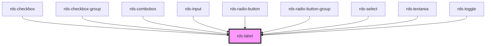

## rds-label Readme

<!-- Auto Generated Below -->

### Properties

| Property | Attribute | Description                                                         | Type     | Default |
| -------- | --------- | ------------------------------------------------------------------- | -------- | ------- |
| `for`    | `for`     | What the label is for; connects label to corresponding form element | `string` | `''`    |

### Slots

| Slot | Description                    |
| ---- | ------------------------------ |
|      | Used to add text to the label. |

### Dependencies

#### Used by

 - [rds-checkbox](../rds-checkbox)
 - [rds-checkbox-group](../rds-checkbox-group)
 - [rds-combobox](../rds-combobox)
 - [rds-input](../rds-input)
 - [rds-radio-button](../rds-radio-button)
 - [rds-radio-button-group](../rds-radio-button-group)
 - [rds-select](../rds-select)
 - [rds-textarea](../rds-textarea)
 - [rds-toggle](../../rds-toggle)

#### Graph

----------------------------------------------

_Built for Resilience Design System @ FM Global_
