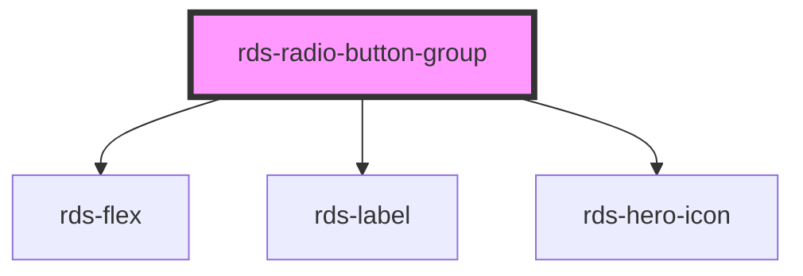

## rds-radio-button-group Readme

<!-- Auto Generated Below -->

### Properties

| Property    | Attribute   | Description                                                                                         | Type                                                        | Default              |
| ----------- | ----------- | --------------------------------------------------------------------------------------------------- | ----------------------------------------------------------- | -------------------- |
| `direction` | `direction` | Sets the direction of the individual radio buttons                                                  | `"horizontal" , "vertical"`                                | `'vertical'`         |
| `disabled`  | `disabled`  | Sets the disabled property of all slotted radio buttons                                             | `boolean`                                                   | `false`              |
| `label`     | `label`     | Sets the label for the entire radio button group                                                    | `string`                                                    | `undefined`          |
| `name`      | `name`      | Sets the name property of all slotted radio buttons                                                 | `string`                                                    | `undefined`          |
| `required`  | `required`  | Sets the required property of all slotted checkboxes                                                | `boolean`                                                   | `false`              |
| `type`      | `type`      | Sets the type property of all slotted radio buttons                                                 | `"card" , "default" , "description-list" , "small-card"` | `'description-list'` |
| `validate`  | `validate`  | If `true`, the radio button group will be validated against the constraint validators that are set. | `boolean`                                                   | `false`              |

### Methods

#### `validateConstraint() => Promise<boolean>`

##### Returns

Type: `Promise<boolean>`

### Slots

| Slot                | Description                                                                  |
| ------------------- | ---------------------------------------------------------------------------- |
|                     | Used to add radio buttons to the radio button group.                         |
| `"group-sub-label"` | Use this slot to add a group-sub-label component to your radio button group. |

### Dependencies

#### Depends on

- [rds-flex](../../rds-flex)
- [rds-label](../rds-label)
- [rds-hero-icon](../../rds-hero-icon)

#### Graph

----------------------------------------------

_Built for Resilience Design System @ FM Global_
