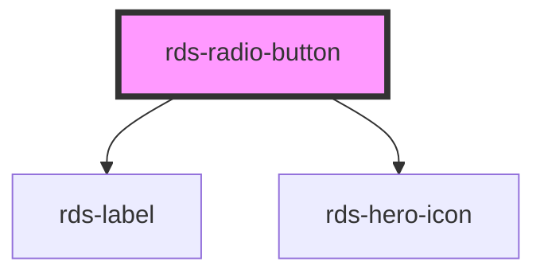

## rds-radio-button Readme

<rds-alert appearance="info" visible>
  
    React Integration Notes
  
  
    Component events can be used two ways:   
    Events will commonly be used as a React prop, in which case, they will be prefixed with 'on' and use camel case. Example: The React prop for the event `rdsOnChange` is `onRdsOnChange`.   
    Alternatively, you can attach an event listener to the component, in which case the event name remains the same.
  
</rds-alert>

<!-- Auto Generated Below -->

### Properties

| Property             | Attribute  | Description                                                                                                              | Type                                                        | Default     |
| -------------------- | ---------- | ------------------------------------------------------------------------------------------------------------------------ | ----------------------------------------------------------- | ----------- |
| `checked`            | `checked`  | This property directly maps to the checked attribute on the native input.                                                | `boolean`                                                   | `false`     |
| `disabled`           | `disabled` | This property directly maps to the disabled attribute of the native input.                                               | `boolean`                                                   | `false`     |
| `error`              | `error`    | If `true`, radio will be in error/invalid mode.                                                                          | `boolean`                                                   | `false`     |
| `focused`            | `focused`  | The focused state of the radio button.                                                                                   | `boolean`                                                   | `false`     |
| `guid`               | `guid`     | The id attribute of the radio button.  When omitted, a globally unique identifier is used.                               | `string`                                                    | `undefined` |
| `label`              | `label`    | An accessible label to be given to the input.                                                                            | `string`                                                    | `undefined` |
| `name`               | `name`     | This property maps to the name attribute of the native input to ensure a single value to be selected with the same name. | `string`                                                    | `undefined` |
| `required`           | `required` | Whether or not the radio is required.                                                                                    | `boolean`                                                   | `false`     |
| `type`               | `type`     | Set the appearance type of the radio.                                                                                    | `"card" , "default" , "description-list" , "small-card"` | `'default'` |
| `validate`           | `validate` | If `true`, the radio will be validated against the constraint validators that are set.                                   | `boolean`                                                   | `false`     |
| `value` _(required)_ | `value`    | The value of the radio element                                                                                           | `any`                                                       | `undefined` |

### Events

| Event                  | Description                                  | Type                |
| ---------------------- | -------------------------------------------- | ------------------- |
| `rdsOnBlur`            | Emitted when the radio button loses focus.   | `CustomEvent<void>` |
| `rdsOnFocus`           | Emitted when the radio button has focus.     | `CustomEvent<void>` |
| `rdsRadioButtonChange` | Fires only when the radio button is checked. | `CustomEvent<any>`  |

### Methods

#### `getValue() => Promise<string>`

Get the value of radio button input

##### Returns

Type: `Promise<string>`

#### `validateConstraint() => Promise<void>`

Validates the radio button's `input` element.

##### Returns

Type: `Promise<void>`

### Slots

| Slot             | Description                                                                        |
| ---------------- | ---------------------------------------------------------------------------------- |
| `"card-content"` | Use this slot to add additional content below the label of your card radio button. |
| `"sub-label"`    | Use this slot to add a sub-label component to your radio button.                   |

### Dependencies

#### Depends on

- [rds-label](../rds-label)
- [rds-hero-icon](../../rds-hero-icon)

#### Graph

----------------------------------------------

_Built for Resilience Design System @ FM Global_
