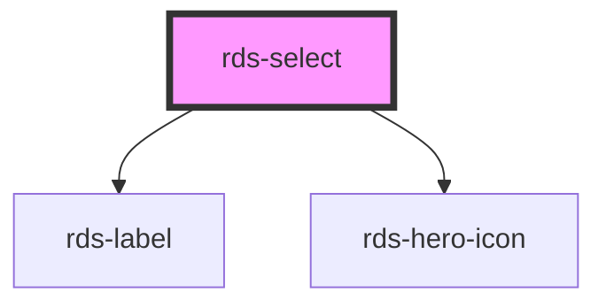

## rds-select Readme

<rds-alert appearance="info" visible>
  
    React Integration Notes
  
  
    Component events can be used two ways:   
    Events will commonly be used as a React prop, in which case, they will be prefixed with 'on' and use camel case. Example: The React prop for the event `rdsOnChange` is `onRdsOnChange`.   
    Alternatively, you can attach an event listener to the component, in which case the event name remains the same.
  
</rds-alert>

<!-- Auto Generated Below -->

### Properties

| Property       | Attribute      | Description                                                                                                                                         | Type                                                                                                                                                                                                                                                                                                                                                                                                                                                                                                                                                                                                                                                                                                                                                                                                                                                                                                                        | Default         |
| -------------- | -------------- | --------------------------------------------------------------------------------------------------------------------------------------------------- | --------------------------------------------------------------------------------------------------------------------------------------------------------------------------------------------------------------------------------------------------------------------------------------------------------------------------------------------------------------------------------------------------------------------------------------------------------------------------------------------------------------------------------------------------------------------------------------------------------------------------------------------------------------------------------------------------------------------------------------------------------------------------------------------------------------------------------------------------------------------------------------------------------------------------- | --------------- |
| `autocomplete` | `autocomplete` | Indicates whether the value of the control can be automatically completed by the browser.                                                           | `"on" , "off" , "name" , "honorific-prefix" , "given-name" , "additional-name" , "family-name" , "honorific-suffix" , "nickname" , "email" , "username" , "new-password" , "current-password" , "one-time-code" , "organization-title" , "organization" , "street-address" , "address-line1" , "address-line2" , "address-line3" , "address-level4" , "address-level3" , "address-level2" , "address-level1" , "country" , "country-name" , "postal-code" , "cc-name" , "cc-given-name" , "cc-additional-name" , "cc-family-name" , "cc-number" , "cc-exp" , "cc-exp-month" , "cc-exp-year" , "cc-csc" , "cc-type" , "transaction-currency" , "transaction-amount" , "language" , "bday" , "bday-day" , "bday-month" , "bday-year" , "sex" , "tel" , "tel-country-code" , "tel-national" , "tel-area-code" , "tel-local" , "tel-extension" , "impp" , "url" , "photo"` | `'off'`         |
| `disabled`     | `disabled`     | If `true`, select is set to disabled mode.                                                                                                          | `boolean`                                                                                                                                                                                                                                                                                                                                                                                                                                                                                                                                                                                                                                                                                                                                                                                                                                                                                                                   | `false`         |
| `error`        | `error`        | If `true`, select will be in error/invalid mode.                                                                                                    | `boolean`                                                                                                                                                                                                                                                                                                                                                                                                                                                                                                                                                                                                                                                                                                                                                                                                                                                                                                                   | `false`         |
| `helptext`     | `helptext`     | **[DEPRECATED]** If `true`, and slot contents are fulfilled, help text will appear below select component.   | `boolean`                                                                                                                                                                                                                                                                                                                                                                                                                                                                                                                                                                                                                                                                                                                                                                                                                                                                                                                   | `false`         |
| `label`        | `label`        | Label to be displayed in relation to its `RdsSelect` component.                                                                                     | `string`                                                                                                                                                                                                                                                                                                                                                                                                                                                                                                                                                                                                                                                                                                                                                                                                                                                                                                                    | `''`            |
| `multiple`     | `multiple`     | if `true` multi-select mode will be enabled.                                                                                                        | `boolean`                                                                                                                                                                                                                                                                                                                                                                                                                                                                                                                                                                                                                                                                                                                                                                                                                                                                                                                   | `false`         |
| `name`         | `name`         | The name attribute of the select element.                                                                                                           | `string`                                                                                                                                                                                                                                                                                                                                                                                                                                                                                                                                                                                                                                                                                                                                                                                                                                                                                                                    | `this.selectId` |
| `native`       | `native`       | If `true` select is using native HTML for select. Otherwise, will be a custom element.                                                              | `boolean`                                                                                                                                                                                                                                                                                                                                                                                                                                                                                                                                                                                                                                                                                                                                                                                                                                                                                                                   | `true`          |
| `required`     | `required`     | Whether or not the select component is required.                                                                                                    | `boolean`                                                                                                                                                                                                                                                                                                                                                                                                                                                                                                                                                                                                                                                                                                                                                                                                                                                                                                                   | `false`         |
| `validate`     | `validate`     | If `true`, the select will be validated against the constraint validators that are set.                                                             | `boolean`                                                                                                                                                                                                                                                                                                                                                                                                                                                                                                                                                                                                                                                                                                                                                                                                                                                                                                                   | `false`         |
| `width`        | `width`        | **[DEPRECATED]** The width of the select component.                                                          | `string`                                                                                                                                                                                                                                                                                                                                                                                                                                                                                                                                                                                                                                                                                                                                                                                                                                                                                                                    | `'full'`        |

### Events

| Event         | Description                                   | Type                                  |
| ------------- | --------------------------------------------- | ------------------------------------- |
| `rdsOnBlur`   | Emitted when the select loses focus.          | `CustomEvent<void>`                   |
| `rdsOnChange` | Emitted when the selects's value has changed. | `CustomEvent<InputChangeEventDetail>` |
| `rdsOnFocus`  | Emitted when the select has focus.            | `CustomEvent<void>`                   |

### Methods

#### `validateConstraint() => Promise<boolean>`

##### Returns

Type: `Promise<boolean>`

### Slots

| Slot           | Description                                        |
| -------------- | -------------------------------------------------- |
| `"error-text"` | Use this slot to set error text for your select.   |
| `"help-text"`  | Sets and adds optional helper text to your select. |

### Dependencies

#### Depends on

- [rds-label](../rds-label)
- [rds-hero-icon](../../rds-hero-icon)

#### Graph

----------------------------------------------

_Built for Resilience Design System @ FM Global_
