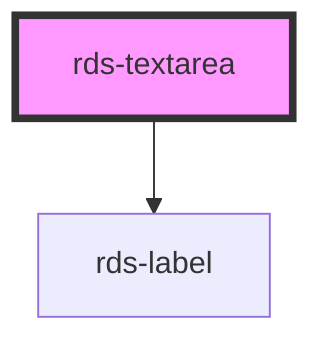

## rds-textarea Readme

<rds-alert appearance="info" visible>
  
    React Integration Notes
  
  
    Component events can be used two ways:   
    Events will commonly be used as a React prop, in which case, they will be prefixed with 'on' and use camel case. Example: The React prop for the event `rdsOnChange` is `onRdsOnChange`.   
    Alternatively, you can attach an event listener to the component, in which case the event name remains the same.
  
</rds-alert>

<!-- Auto Generated Below -->

### Properties

| Property             | Attribute              | Description                                                                                                                                       | Type                                          | Default           |
| -------------------- | ---------------------- | ------------------------------------------------------------------------------------------------------------------------------------------------- | --------------------------------------------- | ----------------- |
| `cols`               | `cols`                 | **[DEPRECATED]** Specifies the visible number of cols in a text area                                       | `number`                                      | `undefined`       |
| `disabled`           | `disabled`             | If `true`, textarea is set to disabled mode.                                                                                                      | `boolean`                                     | `false`           |
| `error`              | `error`                | If `true`, textarea will be in error/invalid mode.                                                                                                | `boolean`                                     | `false`           |
| `helptext`           | `helptext`             | **[DEPRECATED]** If `true`, and slot contents are fulfilled, help text will appear below input component   | `boolean`                                     | `false`           |
| `label`              | `label`                | Label to be displayed in relation to its `RdsTextarea` component                                                                                  | `string`                                      | `''`              |
| `maxlength`          | `maxlength`            | Defines maximum number of character allowed.                                                                                                      | `number`                                      | `undefined`       |
| `minlength`          | `minlength`            | Defines minimum number of character allowed.                                                                                                      | `number`                                      | `undefined`       |
| `name`               | `name`                 | The name attribute of the textarea element.                                                                                                       | `string`                                      | `this.textareaId` |
| `placeholder`        | `placeholder`          | Placeholder text to be displayed inside the `<textarea>` component                                                                                | `string`                                      | `undefined`       |
| `readonly`           | `readonly`             | If `true`, textarea is set to readonly mode.                                                                                                      | `boolean`                                     | `false`           |
| `required`           | `required`             | Whether or not the textarea component is required.                                                                                                | `boolean`                                     | `false`           |
| `resize`             | `resize`               | Whether resize is to be enabled on the textarea component.                                                                                        | `"horizontal" , "off" , "on" , "vertical"` | `'off'`           |
| `rows`               | `rows`                 | **[DEPRECATED]** Specifies the visible number of lines in a text area                                      | `number`                                      | `5`               |
| `triggerFocusEvents` | `trigger-focus-events` |                                                                                                                                                   | `boolean`                                     | `true`            |
| `validate`           | `validate`             | If `true`, the textarea will be validated against the constraint validators that are set.                                                         | `boolean`                                     | `false`           |
| `value`              | `value`                | The value of the textarea element                                                                                                                 | `string`                                      | `''`              |

### Events

| Event         | Description                             | Type                                  |
| ------------- | --------------------------------------- | ------------------------------------- |
| `rdsOnBlur`   | Emitted when the input loses focus.     | `CustomEvent<FocusEvent>`             |
| `rdsOnChange` | Emitted when the value has changed.     | `CustomEvent<InputChangeEventDetail>` |
| `rdsOnFocus`  | Emitted when the input has focus.       | `CustomEvent<FocusEvent>`             |
| `rdsOnInput`  | Emitted when a keyboard input occurred. | `CustomEvent<KeyboardEvent>`          |

### Methods

#### `getInputElement() => Promise<HTMLTextAreaElement>`

Returns the `<textarea>` element.

##### Returns

Type: `Promise<HTMLTextAreaElement>`

#### `setBlur() => Promise<void>`

Sets blur on the `<textarea>` for `rds-textarea`. Use this method instead of
`input.blur()`.

##### Returns

Type: `Promise<void>`

#### `setFocus() => Promise<void>`

Sets focus on the `<textarea>` for `rds-textarea`. Use this method instead of
`input.focus()`.

##### Returns

Type: `Promise<void>`

#### `validateConstraint() => Promise<void>`

##### Returns

Type: `Promise<void>`

### Slots

| Slot           | Description                                       |
| -------------- | ------------------------------------------------- |
| `"error-text"` | Use this slot to set error text for your input.   |
| `"help-text"`  | Sets and adds optional helper text to your input. |

### Dependencies

#### Depends on

- [rds-label](../rds-label)

#### Graph

----------------------------------------------

_Built for Resilience Design System @ FM Global_
