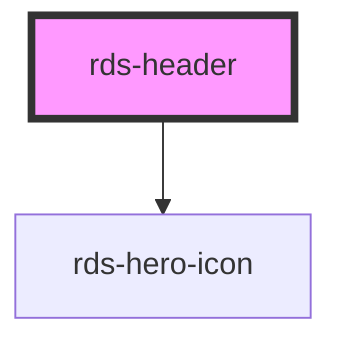

## rds-header Readme

<rds-alert appearance="info" visible>
  
    React Integration Notes
  
  
    Component events can be used two ways:   
    Events will commonly be used as a React prop, in which case, they will be prefixed with 'on' and use camel case. Example: The React prop for the event `rdsOnChange` is `onRdsOnChange`.   
    Alternatively, you can attach an event listener to the component, in which case the event name remains the same.
  
</rds-alert>

<!-- Auto Generated Below -->

### Properties

| Property | Attribute | Description                                                                                                                                           | Type      | Default     |
| -------- | --------- | ----------------------------------------------------------------------------------------------------------------------------------------------------- | --------- | ----------- |
| `nav`    | `nav`     | This property removes the mobile navigation bars from mobile when a navigation component doesn't exist.                                               | `boolean` | `true`      |
| `type`   | `type`    | **[DEPRECATED]** Determines the header type. Options are: 'base' for latest, leave blank for default layout.   | `string`  | `undefined` |

### Events

| Event      | Description                               | Type               |
| ---------- | ----------------------------------------- | ------------------ |
| `closeNav` | Event emitted when nav is closed by click | `CustomEvent<any>` |
| `openNav`  | Event emitted when nav is opened by click | `CustomEvent<any>` |

### Slots

| Slot                 | Description                                                                                          |
| -------------------- | ---------------------------------------------------------------------------------------------------- |
|                      | Used to add content to the header without any formatting included.                                   |
| `"account-selector"` | Used to add an account selector on the left side of the header, just right of the logo if it exists. |
| `"logo"`             | Used to add the FM Global logo on the left side of the header.                                       |
| `"profile"`          | Used to add a profile pattern on the right side of the header.                                       |
| `"search"`           | Used to place a search component inside the header.                                                  |

### Dependencies

#### Depends on

- [rds-hero-icon](../rds-hero-icon)

#### Graph

----------------------------------------------

_Built for Resilience Design System @ FM Global_
