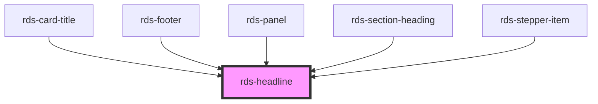

## rds-headline Readme

<!-- Auto Generated Below -->

### Properties

| Property  | Attribute | Description                                                         | Type                                                          | Default      |
| --------- | --------- | ------------------------------------------------------------------- | ------------------------------------------------------------- | ------------ |
| `color`   | `color`   | The color of the headline.                                          | `"green" , TailwindColors`                                   | `undefined`  |
| `level`   | `level`   | The heading level is set to determine the heading tag to be applied | `1 , 2 , 3 , 4 , 5 , 6`                                  | `1`          |
| `spacing` | `spacing` | Spacing controls the top and bottom margin on the headline tags.    | `"lg" , "md" , "none" , "sm"`                              | `'md'`       |
| `weight`  | `weight`  | The weight for the headline.                                        | `"bold" , "extrabold" , "medium" , "normal" , "semibold"` | `'semibold'` |

### Slots

| Slot | Description                       |
| ---- | --------------------------------- |
|      | Used to add text to the headline. |

### Dependencies

#### Used by

 - [rds-card-title](../rds-card-title)
 - [rds-footer](../rds-footer)
 - [rds-panel](../rds-panel)
 - [rds-section-heading](../rds-section-heading)
 - [rds-stepper-item](../rds-stepper-item)

#### Graph

----------------------------------------------

_Built for Resilience Design System @ FM Global_
