## rds-hero-icon Readme

<!-- Auto Generated Below -->

### Properties

| Property | Attribute | Description                                                              | Type                                                                                                                                                                                                                                                                                                                                                                                                                                                                                                                                                                                                                                                                                                                                                                                                                                                                                                                           | Default     |
| -------- | --------- | ------------------------------------------------------------------------ | ------------------------------------------------------------------------------------------------------------------------------------------------------------------------------------------------------------------------------------------------------------------------------------------------------------------------------------------------------------------------------------------------------------------------------------------------------------------------------------------------------------------------------------------------------------------------------------------------------------------------------------------------------------------------------------------------------------------------------------------------------------------------------------------------------------------------------------------------------------------------------------------------------------------------------ | ----------- |
| `bg`     | `bg`      | Set the background color of the icon.                                    | `"blue" , "gray" , "green" , "purple" , "red" , "yellow"`                                                                                                                                                                                                                                                                                                                                                                                                                                                                                                                                                                                                                                                                                                                                                                                                                                                                 | `undefined` |
| `color`  | `color`   | Controls the text color.                                                 | `"black" , "white" , "gray-900" , "gray-800" , "gray-700" , "gray-600" , "gray-500" , "gray-400" , "gray-300" , "gray-200" , "gray-100" , "gray-50" , "purple-900" , "purple-800" , "purple-700" , "purple-600" , "purple-500" , "purple-400" , "purple-300" , "purple-200" , "purple-100" , "purple-50" , "blue-900" , "blue-800" , "blue-700" , "blue-600" , "blue-500" , "blue-400" , "blue-300" , "blue-200" , "blue-100" , "blue-50" , "green-900" , "green-800" , "green-700" , "green-600" , "green-500" , "green-400" , "green-300" , "green-200" , "green-100" , "green-50" , "yellow-900" , "yellow-800" , "yellow-700" , "yellow-600" , "yellow-500" , "yellow-400" , "yellow-300" , "yellow-200" , "yellow-100" , "yellow-50" , "red-900" , "red-800" , "red-700" , "red-600" , "red-500" , "red-400" , "red-300" , "red-200" , "red-100" , "red-50"` | `undefined` |
| `name`   | `name`    | Set the name of the icon to implement.                                   | `string`                                                                                                                                                                                                                                                                                                                                                                                                                                                                                                                                                                                                                                                                                                                                                                                                                                                                                                                       | `'user'`    |
| `shape`  | `shape`   | Set the shape around the icon. This is important if using the `bg` prop. | `"circle" , "rounded"`                                                                                                                                                                                                                                                                                                                                                                                                                                                                                                                                                                                                                                                                                                                                                                                                                                                                                                        | `'rounded'` |
| `size`   | `size`    | Set the size of the icon.  Values: md (16x16), lg (24x24), xl (32x32)    | `"lg" , "md" , "xl"`                                                                                                                                                                                                                                                                                                                                                                                                                                                                                                                                                                                                                                                                                                                                                                                                                                                                                                         | `'md'`      |
| `type`   | `type`    | Set the type of the icon.                                                | `"outline" , "solid"`                                                                                                                                                                                                                                                                                                                                                                                                                                                                                                                                                                                                                                                                                                                                                                                                                                                                                                         | `'solid'`   |

### Dependencies

#### Used by

 - [rds-accordion-item](../rds-accordion-item)
 - [rds-action](../rds-action)
 - [rds-alert](../rds-alert)
 - [rds-banner](../rds-banner)
 - [rds-breadcrumb](../rds-breadcrumb)
 - [rds-checkbox](../rds-form-elements/rds-checkbox)
 - [rds-checkbox-group](../rds-form-elements/rds-checkbox-group)
 - [rds-chip](../rds-chip)
 - [rds-combobox](../rds-form-elements/rds-combobox)
 - [rds-combobox-item](../rds-form-elements/rds-combobox-item)
 - [rds-date-picker-month-header](../rds-form-elements/rds-date-picker-month-header)
 - [rds-fab](../rds-fab)
 - [rds-file-uploader-file](../rds-form-elements/rds-file-uploader/file)
 - [rds-file-uploader-progress](../rds-form-elements/rds-file-uploader/progress)
 - [rds-header](../rds-header)
 - [rds-input](../rds-form-elements/rds-input)
 - [rds-input-date-picker](../rds-form-elements/rds-input-date-picker)
 - [rds-list-item](../rds-list-item)
 - [rds-meta](../rds-meta)
 - [rds-modal](../rds-modal)
 - [rds-nav-item](../rds-nav-item)
 - [rds-radio-button](../rds-form-elements/rds-radio-button)
 - [rds-radio-button-group](../rds-form-elements/rds-radio-button-group)
 - [rds-search](../rds-search)
 - [rds-select](../rds-form-elements/rds-select)
 - [rds-snackbar](../rds-snackbar)
 - [rds-stepper-item](../rds-stepper-item)
 - [rds-tabs](../rds-tabs)
 - [rds-toggle](../rds-toggle)

#### Graph

```mermaid
graph TD;
  rds-accordion-item --> rds-hero-icon
  rds-action --> rds-hero-icon
  rds-alert --> rds-hero-icon
  rds-banner --> rds-hero-icon
  rds-breadcrumb --> rds-hero-icon
  rds-checkbox --> rds-hero-icon
  rds-checkbox-group --> rds-hero-icon
  rds-chip --> rds-hero-icon
  rds-combobox --> rds-hero-icon
  rds-combobox-item --> rds-hero-icon
  rds-date-picker-month-header --> rds-hero-icon
  rds-fab --> rds-hero-icon
  rds-file-uploader-file --> rds-hero-icon
  rds-file-uploader-progress --> rds-hero-icon
  rds-header --> rds-hero-icon
  rds-input --> rds-hero-icon
  rds-input-date-picker --> rds-hero-icon
  rds-list-item --> rds-hero-icon
  rds-meta --> rds-hero-icon
  rds-modal --> rds-hero-icon
  rds-nav-item --> rds-hero-icon
  rds-radio-button --> rds-hero-icon
  rds-radio-button-group --> rds-hero-icon
  rds-search --> rds-hero-icon
  rds-select --> rds-hero-icon
  rds-snackbar --> rds-hero-icon
  rds-stepper-item --> rds-hero-icon
  rds-tabs --> rds-hero-icon
  rds-toggle --> rds-hero-icon
  style rds-hero-icon fill:#f9f,stroke:#333,stroke-width:4px
```

----------------------------------------------

_Built for Resilience Design System @ FM Global_
