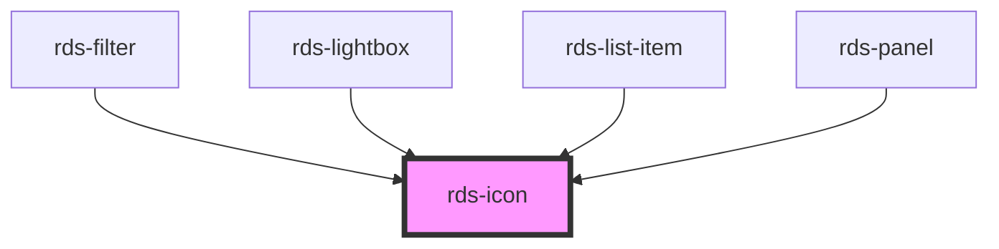

## rds-icon Readme

<!-- Auto Generated Below -->

### Properties

| Property | Attribute | Description                                                                                                                          | Type     | Default     |
| -------- | --------- | ------------------------------------------------------------------------------------------------------------------------------------ | -------- | ----------- |
| `alt`    | `alt`     | **[DEPRECATED]** Set the alternative text of the icon                                         | `string` | `undefined` |
| `color`  | `color`   | **[DEPRECATED]** Sets the color of the icon. Setting no color will inherit from its parent.   | `string` | `undefined` |
| `icon`   | `icon`    | **[DEPRECATED]** Set the name of the icon to implement                                        | `string` | `undefined` |
| `size`   | `size`    | **[DEPRECATED]** Set the size of the icon. Values: md (16x16), lg (24x24), xlg (32x32)        | `string` | `'md'`      |

### Dependencies

#### Used by

 - [rds-filter](../rds-filter)
 - [rds-lightbox](../rds-lightbox)
 - [rds-list-item](../rds-list-item)
 - [rds-panel](../rds-panel)

#### Graph

----------------------------------------------

_Built for Resilience Design System @ FM Global_
