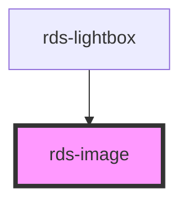

## rds-image Readme

<!-- Auto Generated Below -->

### Properties

| Property       | Attribute       | Description                                                              | Type      | Default     |
| -------------- | --------------- | ------------------------------------------------------------------------ | --------- | ----------- |
| `alt`          | `alt`           | Set the alternative text of the image                                    | `string`  | `undefined` |
| `caption`      | `caption`       | Set the caption text that is displayed under the image                   | `string`  | `undefined` |
| `detail`       | `detail`        | Set the detail text that is displayed under the title text in a lightbox | `string`  | `undefined` |
| `headline`     | `headline`      | Set the title text that is displayed above image in a lightbox           | `string`  | `undefined` |
| `interactive`  | `interactive`   | Set tabindex when inside a lightbox                                      | `boolean` | `false`     |
| `showHeadline` | `show-headline` | Display headline next to image?                                          | `boolean` | `false`     |
| `size`         | `size`          | Size options for thumbnail: 'sm', 'md', 'lg' and 'full'                  | `string`  | `'md'`      |
| `src`          | `src`           | Set the source url of the image                                          | `string`  | `undefined` |
| `thumbnail`    | `thumbnail`     | Size options for small thumb, medium thumb, and large                    | `boolean` | `false`     |

### Shadow Parts

| Part      | Description |
| --------- | ----------- |
| `"image"` |             |

### Dependencies

#### Used by

 - [rds-lightbox](../rds-lightbox)

#### Graph

----------------------------------------------

_Built for Resilience Design System @ FM Global_
