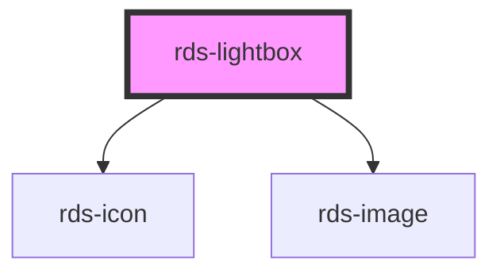

## rds-lightbox Readme

<!-- Auto Generated Below -->

### Properties

| Property | Attribute | Description                       | Type    | Default     |
| -------- | --------- | --------------------------------- | ------- | ----------- |
| `src`    | --        | The source url(s) of the image(s) | `any[]` | `undefined` |

### Methods

#### `focusElement(el?: HTMLElement) => Promise<void>`

Focus first interactive element

##### Returns

Type: `Promise<void>`

#### `setFocus(focusId?: 'close-button') => Promise<void>`

Sets focus on the component.

By default, will try to focus on any focusable content. If there is none, it will focus on the close button.
If you want to focus on the close button, you can use the `close-button` focus ID.

##### Returns

Type: `Promise<void>`

### Dependencies

#### Depends on

- [rds-icon](../rds-icon)
- [rds-image](../rds-image)

#### Graph

----------------------------------------------

_Built for Resilience Design System @ FM Global_
