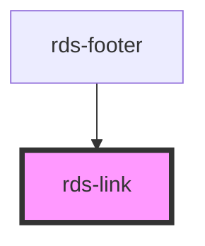

## rds-link Readme

<!-- Auto Generated Below -->

### Properties

| Property     | Attribute    | Description                                                                                                                                         | Type      | Default     |
| ------------ | ------------ | --------------------------------------------------------------------------------------------------------------------------------------------------- | --------- | ----------- |
| `appearance` | `appearance` | The type of the link. Current options are: `"primary"`, `"secondary"`.                                                                              | `string`  | `'primary'` |
| `disabled`   | `disabled`   | This property handles the disabled state of the link.                                                                                               | `boolean` | `false`     |
| `href`       | `href`       | Contains a URL or a URL fragment that the hyperlink points to. If this property is set, an anchor tag will be rendered.                             | `string`  | `undefined` |
| `iconOnly`   | `icononly`   | Determines the padding on the link if an icon is the only contents.                                                                                 | `boolean` | `false`     |
| `label`      | `label`      | Accessible label for link.                                                                                                                          | `string`  | `undefined` |
| `size`       | `size`       | The link size. Options are: `"sm"` and `"base"`                                                                                                     | `string`  | `'base'`    |
| `target`     | `target`     | Specifies where to display the linked URL. Only applies when an `href` is provided. Special keywords: `"_blank"`, `"_self"`, `"_parent"`, `"_top"`. | `string`  | `undefined` |
| `text`       | `text`       | **[DEPRECATED]** You can now type within the link tags set the link text.                                    | `string`  | `undefined` |

### Slots

| Slot      | Description                               |
| --------- | ----------------------------------------- |
|           | Used to add link text.                    |
| `"end"`   | Used to add a trailing icon to your link. |
| `"start"` | Used to add a leading icon to your link.  |

### Dependencies

#### Used by

 - [rds-footer](../rds-footer)

#### Graph

----------------------------------------------

_Built for Resilience Design System @ FM Global_
