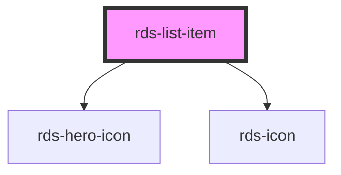

## rds-list-item Readme

<rds-alert appearance="info" visible>
  
    React Integration Notes
  
  
    Component events can be used two ways:   
    Events will commonly be used as a React prop, in which case, they will be prefixed with 'on' and use camel case. Example: The React prop for the event `rdsOnChange` is `onRdsOnChange`.   
    Alternatively, you can attach an event listener to the component, in which case the event name remains the same.
  
</rds-alert>

<!-- Auto Generated Below -->

### Properties

| Property   | Attribute   | Description                                                                                                                                                                                                            | Type                                                                        | Default       |
| ---------- | ----------- | ---------------------------------------------------------------------------------------------------------------------------------------------------------------------------------------------------------------------- | --------------------------------------------------------------------------- | ------------- |
| `active`   | `active`    | **[DEPRECATED]** Determines the state of the list item for navigation purposes                                                                                                  | `boolean`                                                                   | `false`       |
| `columns`  | `columns`   | If true, the list item will be split into two columns. This prop is created for description and stacked list items.                                                                                                    | `boolean`                                                                   | `false`       |
| `href`     | `href`      | Contains a URL or a URL fragment that the hyperlink points to. If this property is set, an anchor tag will be rendered.                                                                                                | `string`                                                                    | `null`        |
| `icon`     | `icon`      | **[DEPRECATED]** Shows icon for main nav items only if true. If set to false, the chevron is hidden. Default This is useful for main nav items that don't have sub-nav items.   | `boolean`                                                                   | `true`        |
| `spacingX` | `spacing-x` | **[DEPRECATED]** Determines the state of the list item for navigation purposes                                                                                                  | `string`                                                                    | `'none'`      |
| `spacingY` | `spacing-y` | **[DEPRECATED]** Determines the state of the list item for navigation purposes                                                                                                  | `string`                                                                    | `'none'`      |
| `target`   | `target`    | **[DEPRECATED]** Set the target of the link of the list item. Set to "_blank" to open link in a new window.                                                                     | `string`                                                                    | `undefined`   |
| `type`     | `type`      | Sets the type of the list item.                                                                                                                                                                                        | `"description" , "main" , "ordered" , "stacked" , "sub" , "unordered"` | `'unordered'` |

### Events

| Event         | Description                                                                                                               | Type                   |
| ------------- | ------------------------------------------------------------------------------------------------------------------------- | ---------------------- |
| `closeSubNav` | **[DEPRECATED]** Event emitted nav item is clicked and needs to collapse Sub Nav   | `CustomEvent<boolean>` |
| `openSubNav`  | **[DEPRECATED]** Event emitted nav item is clicked and needs to expand Sub Nav     | `CustomEvent<boolean>` |

### Slots

| Slot                  | Description                                                         |
| --------------------- | ------------------------------------------------------------------- |
|                       | Used to add content to a list item.                                 |
| `"description-text"`  | Use this slot to set the description list item's text.              |
| `"description-title"` | Use this slot to set the description list item's title.             |
| `"stacked-column"`    | Use this slot to add one or more columns to your stacked list item. |

### Dependencies

#### Depends on

- [rds-hero-icon](../rds-hero-icon)
- [rds-icon](../rds-icon)

#### Graph

----------------------------------------------

_Built for Resilience Design System @ FM Global_
