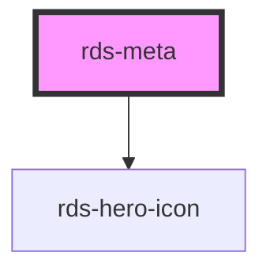

## rds-meta Readme

<!-- Auto Generated Below -->

### Properties

| Property | Attribute | Description                                                                                              | Type     | Default     |
| -------- | --------- | -------------------------------------------------------------------------------------------------------- | -------- | ----------- |
| `icon`   | `icon`    | The name of the icon to display. The value of this property must match the icon name from RDS Hero Icons | `string` | `undefined` |

### Slots

| Slot | Description                                |
| ---- | ------------------------------------------ |
|      | Used to add description for your Hero Icon |

### Dependencies

#### Depends on

- [rds-hero-icon](../rds-hero-icon)

#### Graph

----------------------------------------------

_Built for Resilience Design System @ FM Global_
