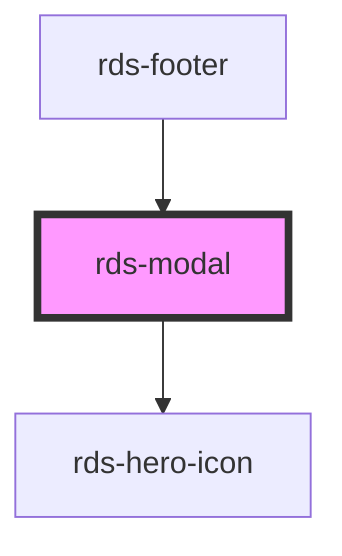

## rds-modal Readme

<rds-alert appearance="info" visible>
  
    React Integration Notes
  
  
    Component events can be used two ways:   
    Events will commonly be used as a React prop, in which case, they will be prefixed with 'on' and use camel case. Example: The React prop for the event `rdsOnChange` is `onRdsOnChange`.   
    Alternatively, you can attach an event listener to the component, in which case the event name remains the same.
  
</rds-alert>

<!-- Auto Generated Below -->

### Properties

| Property              | Attribute             | Description                                                                                                               | Type                                 | Default                   |
| --------------------- | --------------------- | ------------------------------------------------------------------------------------------------------------------------- | ------------------------------------ | ------------------------- |
| `beforeClose`         | --                    | Optionally pass a function to run before close                                                                            | `(el: HTMLElement) => Promise<void>` | `() => Promise.resolve()` |
| `closeButton`         | `closebutton`         | Hides the close button in the top right of the modal to focus user to the action buttons.                                 | `boolean`                            | `true`                    |
| `disableEscape`       | `disableescape`       | Used to disable the default close on escape press.                                                                        | `boolean`                            | `undefined`               |
| `disableOverlayClose` | `disableoverlayclose` | Disables the closing of the Modal when clicking the overlay.                                                              | `boolean`                            | `undefined`               |
| `fullScreen`          | `full-screen`         | If true, the modal is in fullscreen mode.                                                                                 | `boolean`                            | `false`                   |
| `headline`            | `headline`            | The text displayed as the headline of the modal. You can optionally pass in HTML for headline by using the headline slot. | `string`                             | `undefined`               |
| `label`               | `label`               | Accessible label for Modal to use in the aria-label.                                                                      | `string`                             | `undefined`               |
| `visible`             | `visible`             | This sets the visiblity of the modal.                                                                                     | `boolean`                            | `false`                   |

### Events

| Event         | Description                         | Type               |
| ------------- | ----------------------------------- | ------------------ |
| `modalClosed` | Event emitted when modal is closed. | `CustomEvent<any>` |
| `modalOpened` | Event emitted when modal is opened. | `CustomEvent<any>` |

### Methods

#### `closeModal() => Promise<any>`

##### Returns

Type: `Promise<any>`

#### `focusElement(el?: HTMLElement) => Promise<void>`

Focus first interactive element

##### Returns

Type: `Promise<void>`

#### `openModal() => Promise<any>`

##### Returns

Type: `Promise<any>`

#### `setFocus(focusId?: 'close-button') => Promise<void>`

Sets focus on the component.

By default, will try to focus on any focusable content. If there is none, it will focus on the close button.
If you want to focus on the close button, you can use the `close-button` focus ID.

##### Returns

Type: `Promise<void>`

### Slots

| Slot          | Description                                                                        |
| ------------- | ---------------------------------------------------------------------------------- |
| `"headline"`  | A slot for the modal title. This allows for custom headlines using HTML.           |
| `"icon"`      | A slot for a `RdsHeroIcon` to be placed.                                           |
| `"primary"`   | A slot for the primary action, recommend using an `RdsButton` or `RdsLink` here.   |
| `"secondary"` | A slot for the secondary action, recommend using an `RdsButton` or `RdsLink` here. |

### Dependencies

#### Used by

 - [rds-footer](../rds-footer)

#### Depends on

- [rds-hero-icon](../rds-hero-icon)

#### Graph

----------------------------------------------

_Built for Resilience Design System @ FM Global_
