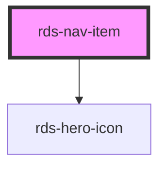

## rds-nav-item Readme

<!-- Auto Generated Below -->

### Properties

| Property | Attribute | Description                                                                                                             | Type      | Default     |
| -------- | --------- | ----------------------------------------------------------------------------------------------------------------------- | --------- | ----------- |
| `active` | `active`  | To show a nav item in an active state, this can be set to true.                                                         | `boolean` | `false`     |
| `href`   | `href`    | Contains a URL or a URL fragment that the hyperlink points to. If this property is set, an anchor tag will be rendered. | `string`  | `undefined` |
| `open`   | `open`    | If `true`, nav item is open and its slotted children are revealed.                                                      | `boolean` | `false`     |
| `target` | `target`  | Set the target of the link of the list item. Set to "_blank" to open link in a new window.                              | `string`  | `undefined` |

### Slots

| Slot      | Description                                                              |
| --------- | ------------------------------------------------------------------------ |
|           | Used to add text to your nav item.                                       |
| `"child"` | Use this slot to add as many children / sub-nav items as you would like. |
| `"icon"`  | Use this slot to add an icon to your nav item.                           |

### Dependencies

#### Depends on

- [rds-hero-icon](../rds-hero-icon)

#### Graph

----------------------------------------------

_Built for Resilience Design System @ FM Global_
