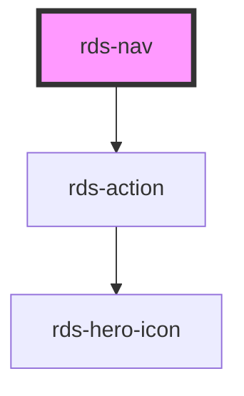

## rds-nav Readme

<rds-alert appearance="info" visible>
  
    React Integration Notes
  
  
    Component events can be used two ways:   
    Events will commonly be used as a React prop, in which case, they will be prefixed with 'on' and use camel case. Example: The React prop for the event `rdsOnChange` is `onRdsOnChange`.   
    Alternatively, you can attach an event listener to the component, in which case the event name remains the same.
  
</rds-alert>

<!-- Auto Generated Below -->

### Properties

| Property      | Attribute     | Description                                                                                                                                                           | Type      | Default       |
| ------------- | ------------- | --------------------------------------------------------------------------------------------------------------------------------------------------------------------- | --------- | ------------- |
| `collapsible` | `collapsible` | When set to true, the user can toggle the state of the navigation component.                                                                                          | `boolean` | `true`        |
| `expanded`    | `expanded`    | Indicates whether nav is expanded. If false, the nav is collapsed. Note: For 'base' nav only.                                                                         | `boolean` | `true`        |
| `label`       | `label`       | This is for an accessible label on the nav element. Please omit the use of the term "navigation".                                                                     | `string`  | `'FM Global'` |
| `type`        | `type`        | **[DEPRECATED]** Determines the layout based on the journey. Options are: 'base' for latest, leave blank for Phase 1 layout.   | `string`  | `undefined`   |

### Events

| Event              | Description                               | Type               |
| ------------------ | ----------------------------------------- | ------------------ |
| `backdropCloseNav` | Event emitted when nav is closed by click | `CustomEvent<any>` |
| `rdsNavToggle`     | Emitted when expanded has been toggled.   | `CustomEvent<any>` |

### Methods

#### `setFocus(focusId?: 'expand-toggle') => Promise<void>`

##### Returns

Type: `Promise<void>`

Sets focus to the nav.

### Slots

| Slot          | Description                                                                                                       |
| ------------- | ----------------------------------------------------------------------------------------------------------------- |
|               | It is recommended to place RdsNavItems inside of RdsNav, this slot will be used for those sub-components.         |
| `"tools"`     | This slot can be used for secondary navitems to be placed under the Tools section.                                |
| `"user-menu"` | This slot is used to place the alternative mobile profile menu to replace the profile menu located in the header. |

### Dependencies

#### Depends on

- [rds-action](../rds-action)

#### Graph

----------------------------------------------

 
