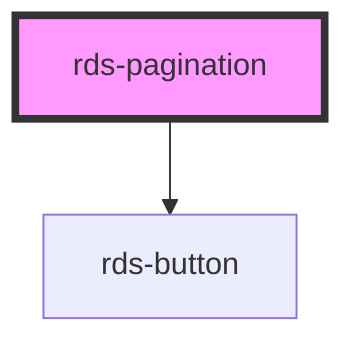

## rds-pagination Readme

<rds-alert appearance="info" visible>
  
    React Integration Notes
  
  
    Component events can be used two ways:   
    Events will commonly be used as a React prop, in which case, they will be prefixed with 'on' and use camel case. Example: The React prop for the event `rdsOnChange` is `onRdsOnChange`.   
    Alternatively, you can attach an event listener to the component, in which case the event name remains the same.
  
</rds-alert>

<!-- Auto Generated Below -->

### Properties

| Property | Attribute | Description                              | Type     | Default |
| -------- | --------- | ---------------------------------------- | -------- | ------- |
| `items`  | `items`   | number of items per page                 | `number` | `10`    |
| `start`  | `start`   | index of item that should begin the page | `number` | `1`     |
| `total`  | `total`   | total number of items                    | `number` | `0`     |

### Events

| Event                 | Description                                 | Type                               |
| --------------------- | ------------------------------------------- | ---------------------------------- |
| `rdsPaginationChange` | Emitted whenever the selected page changes. | `CustomEvent<RdsPaginationDetail>` |
| `rdsPaginationUpdate` | Emitted whenever the selected page changes. | `CustomEvent<RdsPaginationDetail>` |

### Methods

#### `nextPage() => Promise<void>`

Go to the next page of results

##### Returns

Type: `Promise<void>`

#### `previousPage() => Promise<void>`

Go to the previous page of results

##### Returns

Type: `Promise<void>`

### Dependencies

#### Depends on

- [rds-button](../rds-button)

#### Graph

----------------------------------------------

_Built for Resilience Design System @ FM Global_
