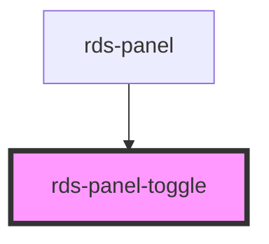

## rds-panel-toggle Readme

<!-- Auto Generated Below -->

### Properties

| Property   | Attribute   | Description                                                                                                                                                                                                                                               | Type      | Default     |
| ---------- | ----------- | --------------------------------------------------------------------------------------------------------------------------------------------------------------------------------------------------------------------------------------------------------- | --------- | ----------- |
| `autoHide` | `auto-hide` | Automatically hides the content when the corresponding panel is not active.  By default, it's `true`. Change it to `false` in order to keep `rds-panel-toggle` always visible regardless the state of the panel.                                          | `boolean` | `true`      |
| `panel`    | `panel`     | Optional property that maps to a Panel's `panelId` prop. Can also be `start` or `end` for the panel side. This is used to find the correct panel to toggle.  If this property is not used, `rds-panel-toggle` will toggle the first panel that is active. | `string`  | `undefined` |

### Slots

| Slot | Description                                                             |
| ---- | ----------------------------------------------------------------------- |
|      | Used to add a button / other element to be engaged as a panel's toggle. |

### Dependencies

#### Used by

 - [rds-panel](../rds-panel)

#### Graph

----------------------------------------------

_Built for Resilience Design System @ FM Global_
